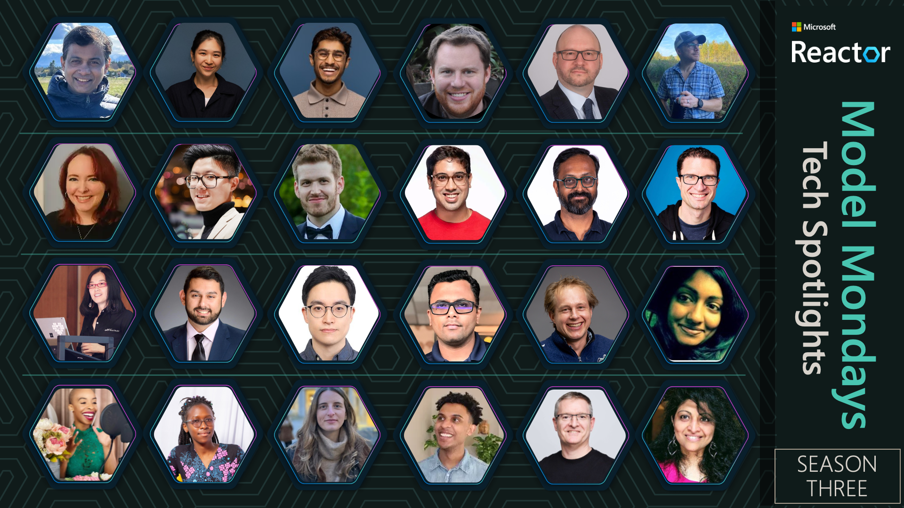
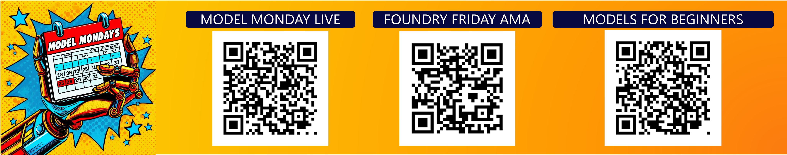
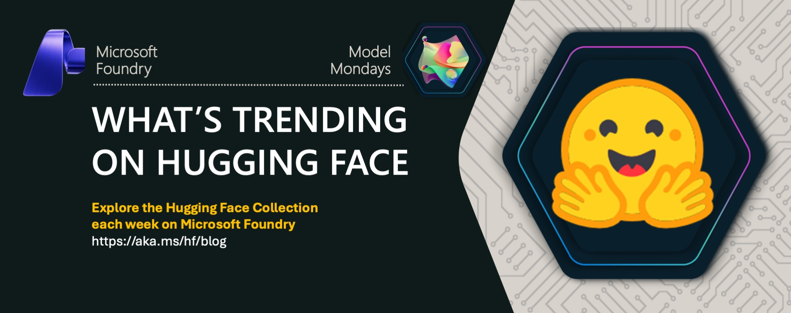

# Model Mondays: Build Your Model IQ

     

> 🌟 If you find this series useful, give us a star on GitHub!

---

 

As an AI native engineer, your journey starts with model choice. But with 10K+ models in Microsoft Foundry, 2M+ open-source model in Hugging Face, and new model releases every day, _how do you make informed decisions?_ With Model Mondays, we have three resources to help you go from awareness to action to adoption.

1. [Model Mondays livestream](https://aka.ms/model-mondays/rsvp) - every Monday at 1:30pm EST with news, tech spotlights & customer stories
1. [Foundry Friday AMA](https://aka.ms/model-mondays/discord) - every Monday at 1:30pm EST with demos, Q&A featuring subject matter experts
1. [Models For Beginners](https://aka.ms/models-for-beginners) - curriculum planned for release in 2026.

**Build your Model IQ** one week at a time - and go from scenario to solution by learning model fundamentals, understanding model selection, exploring model customization, and building trustworthy AI solutions with end-to-end observability. Join us by taking two actions today:

1. [Join the Discord](https://aka.ms/model-mondays/discord) - and follow the _#model-mondays_ channel for regular updates!
1. [Register for the Livestream](https://aka.ms/model-mondays/rsvp) - and watch for new updates to the schedule in 2026

 

## Season 3: Dec 2025 - Apr 2026

In Season 3, we are putting the tech spotlight on [Microsoft Foundry](https://ai.azure.com) and bringing in product group leads and subject matter experts to talk about the unified platform and tech stack that powers the app and agent factory! Season 3 is currently planned for a 16-episode arc going from Dec 2025 to Apr 2026. **In addition to tech spotlights, watch for new customer stories and new segments including Study Corner and Partner Spotlights**.

| Ep | Live | AMA | Partner/Story | Tech Spotlight | Description |
|:---|:---|:---|:---|:---|:---|
| 01 | [Dec 01](https://developer.microsoft.com/en-us/reactor/events/26347/) | [Dec 05](docs/foundry-fridays/2025-12-05-s03-e01-model-router-ama.md) | [Adobe](docs/customer-stories/README.md#dec-1st-2025-adobe) | Sanjeev Jagtap | [Model Router](https://learn.microsoft.com/en-us/azure/ai-foundry/openai/concepts/model-router?view=foundry): Learn why smart model routing matters for cost-effective AI deployment |
| 02 | [Dec 08](https://developer.microsoft.com/en-us/reactor/events/26577/) | [Dec 12](docs/foundry-fridays/2025-12-12-s03-e02-red-teaming-ama.md) | [Ada](docs/customer-stories/README.md#dec-8th-2025-ada) | Minsoo Thigpen | [AI Red Teaming](https://learn.microsoft.com/en-us/azure/ai-foundry/concepts/ai-red-teaming-agent?view=foundry): Discover how to assess risks and build trustworthy AI with automated adversarial testing |
| 03 | [Dec 15](https://developer.microsoft.com/en-us/reactor/events/26578/) | [Dec 19](docs/foundry-fridays/2025-12-19-s03-e03-edge-ai-ama.md) | [eClinicalWorks](docs/customer-stories/README.md#dec-15th-2025-eclinicalworks) | Maanav Dalal | [Foundry Local](https://www.foundrylocal.ai/): Explore on-device inference with data privacy for edge AI applications |
|  | ✨✨✨ | ✨✨✨ | ✨✨✨✨✨✨ | FESTIVE HOLIDAY | ✨✨✨✨✨✨ |
| 04 | [Jan 12](https://developer.microsoft.com/en-us/reactor/events/26643/) | [Jan 16](docs/foundry-fridays/2026-01-16-s03-e04-agent-framework-ama.md) | [InWorld.AI](docs/customer-stories/README.md#jan-12th-2025-inworldai) | Shawn Henry | [Microsoft Agent Framework](https://learn.microsoft.com/agent-framework/overview/agent-framework-overview): Build scalable AI solutions with multi-agent orchestration |
| 05 | [Jan 19](https://aka.ms/model-mondays/rsvp) | [Jan 23](docs/foundry-fridays/2026-01-23-s03-e05-holiday.md) | ✨✨✨✨✨✨ | US HOLIDAY | ✨✨✨✨✨✨ |
| 06 | [Jan 26](https://aka.ms/model-mondays/rsvp) | [Jan 30](docs/foundry-fridays/2026-01-30-s03-e06-fine-tuning-ama.md) | [Relativity](docs/customer-stories/README.md#jan-26th-2025-relativity) | Dave Voutila & Guy Gregory | [Fine-Tuning](https://learn.microsoft.com/en-us/azure/ai-foundry/openai/concepts/fine-tuning-considerations?view=foundry) & [Responses API](https://learn.microsoft.com/en-us/azure/ai-foundry/openai/how-to/responses?view=foundry&tabs=python-key): Master model customization and streamline agent creation with unified APIs |
| 07 | [Feb 02](https://aka.ms/model-mondays/rsvp) | [Feb 06](docs/foundry-fridays/2026-02-06-s03-e07-synthetic-data-ama.md) | | William Liang | [Synthetic Data Generation](https://learn.microsoft.com/en-us/azure/ai-foundry/openai/how-to/responses?view=foundry&tabs=python-key): Create high-quality, safe datasets for model evaluation and fine-tuning |
| 08 | [Feb 09](https://aka.ms/model-mondays/rsvp) | [Feb 13](docs/foundry-fridays/2026-02-13-s03-e08-ui-experiences-ama.md) | | Amir Zur | [Foundry Portal](https://learn.microsoft.com/en-us/azure/ai-foundry/what-is-foundry?view=foundry#microsoft-foundry-portals): Experience next-gen UI with end-to-end workflows from planning to production |
| 09 | [Feb 16](https://aka.ms/model-mondays/rsvp) | [Feb 20](docs/foundry-fridays/2026-02-20-s03-e09-research-models-ama.md) | | Yash Lara | [Foundry Labs](https://aka.ms/model-mondays): Experiment with cutting-edge models and tools from Microsoft Research |
| 10 | [Feb 23](https://aka.ms/model-mondays/rsvp) | [Feb 27](docs/foundry-fridays/2026-02-27-s03-e10-foundry-agents-ama.md) | | Bala Venkataraman | [Foundry Agents](https://learn.microsoft.com/en-us/azure/ai-foundry/agents/overview?view=foundry): Discover the unified runtime that takes you from planning to production |
| 11 | [Mar 02](https://aka.ms/model-mondays/rsvp) | [Mar 06](docs/foundry-fridays/2026-03-06-s03-e11-control-plane-ama.md) | | Sebastian Kohlmeier | [Foundry Control Plane](https://learn.microsoft.com/en-us/azure/ai-foundry/control-plane/overview?view=foundry): Manage multi-agent fleets at enterprise scale with unified observability |
| 12 | [Mar 09](https://aka.ms/model-mondays/rsvp) | [Mar 13](docs/foundry-fridays/2026-03-13-s03-e12-dev-experience-ama.md) | | Rong Lu | [AI Toolkit](https://learn.microsoft.com/en-us/windows/ai/toolkit/): Build, evaluate, and deploy AI solutions directly from VS Code |
| 13 | [Mar 16](https://aka.ms/model-mondays/rsvp) | [Mar 20](docs/foundry-fridays/2026-03-20-s03-e13-foundry-iq-ama.md) | | Farzad Sunavala | [Foundry IQ](https://learn.microsoft.com/en-us/azure/ai-foundry/agents/how-to/tools/knowledge-retrieval?view=foundry&tabs=foundry%2Cpython): Power your agents with unified knowledge layer and intelligent retrieval |
| 14 | [Mar 23](https://aka.ms/model-mondays/rsvp) | [Mar 27](docs/foundry-fridays/2026-03-27-s03-e14-foundry-tools-ama.md) | | SeokJin Han | [Foundry Tools & MCP](https://learn.microsoft.com/en-us/azure/ai-services/what-are-ai-services?view=foundry): Extend agent capabilities with MCP server integration and tool discovery |
| 15 | [Mar 30](https://aka.ms/model-mondays/rsvp) | [Apr 03](docs/foundry-fridays/2026-04-03-s03-e15-agent365-ama.md) | | Srikumar Nair | [Agent 365](https://www.microsoft.com/en-us/microsoft-agent-365): Integrate agents seamlessly into Microsoft 365 with secure, managed infrastructure |
| 16 | [Apr 06](https://aka.ms/model-mondays/rsvp) | [Apr 10](docs/foundry-fridays/2026-04-10-s03-e16-github-workflows-ama.md) | | Peli de Halleux | [GitHub Agentic Workflows](https://githubnext.github.io/gh-aw/): Automate GitHub tasks safely using AI agents with plain English instructions |
| | | | | | |

With 21 livestream episodes and 31 AMA sessions completed, we now have a well-defined format that has resonated with AI native engineers and decision-makers alike. As we began planning Season 3, we thought about how we could use the platform to support one additional audience: _learners and partners_. In 2026, look for new segments like _Partner Spotlights_ featuring model providers, _This Week In Hugging Face_ spotlighting open-source models, and _Study Corner_ showcasing self-guided labs and curricula for skilling.

 

## 🆕 · This Week In Hugging Face 🤗

Did you know Microsoft Foundry gives you access to 10K+ open-source models through the [Hugging Face Collection](https://aka.ms/hf/foundry-models)? Starting in Feb 2026, look for a weekly update on what's trending in Hugging Face where we feature 3 models and give you some intuition for what makes them notable for AI devs.

- Visit [this page](./docs/hugging-face/README.md) to learn more & view shared models
- Track [this tag](https://aka.ms/hf/blog) for a weekly blog post & deep-dive.

 

## Nov 2025: Mission Agent Possible At Microsoft Ignite

So many models - so how do you actually learn how to do model selection right? The best way is to work with existing tools and platforms to solve a real-world problem. _You learn more by doing!_

What if we put the "fun" back into Model Fundamentals? Model Mondays joined forces with the M365 Advocacy team to try an interesting experiment at Microsoft Ignite. Stay tuned for a special segment on Model Mondays Season 3 where we share insights from the contest, and celebrate our winners!

1. [Read The Contest Rules](https://aka.ms/can-i-win) - to understand requirements
1. [Read The Contest Blog](https://aka.ms/models-blog) - to learn the tasks & get started
1. [RSVP to Model Mondays](https://aka.ms/model-mondays/rsvp) - for a featured celebration in December.

 

## Season 2: Jun 2025 - Sep 2025

> **Season 2 kicked off on Jun 16, 2025 and will run through Sep 2025. =Use the **Register** links to get reminders for upcoming events, and visit the **Replay** and **Recap** links to revisit past episodes and AMAs. Watch the complete [playlist of all series of Model Mondays](http://aka.ms/model-mondays/playlist)**

| Episode | Topic | Monday Livestream | Friday AMA| Slides | Blog |
|:---|:---|:---|:---|:---|:---|
| S2:E01 | Advanced Reasoning |  |  | | |
| S2:E02 | Model Context Protocol|  |  | ||
| S2:E03| SLMs and Reasoning |  |  | ||
| S2:E04| AI & Dev Experience |  |  | ||
| S2:E05| Fine-Tuning & Distillation |  |  | | 
| S2:E06| Research & Innovation |  |  | | |
| S2:E07| AI-Assisted Azure Dev |  |  | | |
| S2:E08| On-Device & Local AI |  |  | | |
| S2:E09| AI Agents |  |  | | |
| S2:E10| Document Processing |  |  | | |
| S2:E11| AI Foundry Speech Playground |  |  | | 
| S2:E12| Models & Observability |  |  | |   |
| S2:E13| Open-Source Models (Hugging Face)  |  |  |  |  |
| | | |

> **Want to get more details about each session? [Check out the Season 2 page](./.2025/season-02/README.md) for more information on each session including speakers, description and links to recaps and slides.** 

---

 

## Season 1: Mar 2025 - May 2025

 
 
 
 
 
  
 
 

> **Our pilot season featured 8 episodes covering models (green badges) and tools (magenta badges) in Microsoft Foundry. [Visit the Season 1 page](./.2025/season-01/README.md) for details or click the episode specific badge below to go directly to the replay.**

| Episode | Video | Blog | Slides | AMA | 
|:---|:---|:---|:---|:---|
| E01 · GitHub Models | [**Play ▶️**](https://developer.microsoft.com/reactor/events/25265/)| [GitHub Models](https://techcommunity.microsoft.com/blog/machinelearningblog/introducing-model-mondays-%E2%80%93-your-ai-model-power-up/4390773) | [PDF](https://speakerdeck.com/nitya/model-mondays-s1-e1-mar-10-2025)  | [Mar 14](docs/foundry-fridays/2025-03-14-s01-e01-github-models-ama.md)  |
| E02 ·  Reasoning Models | [**Play ▶️**](https://developer.microsoft.com/reactor/events/25266/) | [OpenAI, DeepSeek](./.2025/season-01/ep-02.md)| [PDF](https://speakerdeck.com/nitya/model-mondays-s1-e2-hands-on-with-reasoning-models) | [Mar 21](docs/foundry-fridays/2025-03-21-s01-e02-reasoning-ama.md) | 
| E03 ·  Search + Retrieval  |  [**Play ▶️**](https://developer.microsoft.com/en-us/reactor/events/25354/) |[Cohere Rerank](https://techcommunity.microsoft.com/blog/machinelearningblog/model-mondays-why-rerank-models-are-the-secret-sauce-of-high-quality-search/4396032) | [PDF](https://speakerdeck.com/nitya/model-mondays-s1-e3-hands-on-with-search-and-retrieval-models)  | [Mar 28](docs/foundry-fridays/2025-03-28-s01-e03-search-retrieval-ama.md) |
| E04 ·  Visual + Generative  |[**Play ▶️**](https://developer.microsoft.com/reactor/events/25355/) |[Stable Diffusion](https://techcommunity.microsoft.com/blog/machinelearningblog/model-mondays-lights-prompts-action/4398576) |  [PDF](https://speakerdeck.com/nitya/model-mondays-s1-e4-hands-on-with-visual-generative-ai) | [Apr 04](docs/foundry-fridays/2025-04-04-s01-e04-visual-generative-ama.md) |
| E05 ·  Fine-Tuning  |[**Play ▶️**](https://developer.microsoft.com/reactor/events/25356/)  |[Mistral](https://techcommunity.microsoft.com/blog/machinelearningblog/model-mondays-teaching-your-model-new-tricks-with-fine-tuning/4401129) | [PDF](https://speakerdeck.com/nitya/model-mondays-s1-e4-hands-on-with-fine-tuning-models) | [Apr 11](docs/foundry-fridays/2025-04-11-s01-e05-fine-tuning-ama.md)| |
| E06 ·  Local AI Development |[**Play ▶️**](https://developer.microsoft.com/reactor/events/25357/)  | [AI Toolkit (AITK)](https://techcommunity.microsoft.com/blog/machinelearningblog/model-mondays-bringing-ai-home-with-local-development/4403619) |  [PDF](https://speakerdeck.com/nitya/model-mondays-s1-e6-hands-on-with-local-ai-development) | [Apr 18](docs/foundry-fridays/2025-04-18-s01-e06-local-ai-ama.md) |
| E07 ·  Open Source & AI  |[**Play ▶️**](https://developer.microsoft.com/reactor/events/25358/)  | [Llama 4 (Meta)](https://techcommunity.microsoft.com/blog/aiplatformblog/expanding-the-llama-4-herd-new-models-now-available-on-azure-ai-foundry/4403609)| [PDF](https://speakerdeck.com/nitya/model-mondays-s1-e7-hands-on-with-open-source-models) | [Apr 25](docs/foundry-fridays/2025-04-25-s01-e07-open-source-ama.md)|
| E08 ·  Forecasting Models |[**Play ▶️**](https://developer.microsoft.com/reactor/events/25359/)  | Nixtla TimeGEN | - | [May 02](docs/foundry-fridays/2025-05-02-s01-e08-forecasting-ama.md) |
| | |

 

## 👉🏽👉🏽 Join The Community

Great devs don't build alone! In a fast-pased developer ecosystem, there's no time to hunt for help. That's why we have the Azure AI Developer Community. Join us today and let's journey together!

1. [Join the Discord](https://aka.ms/model-mondays/discord) - for real-time chats, events & learning
1. [Explore the Forum](https://aka.ms/model-mondays/forum) - for AMA recaps, Q&A, and help!

 
