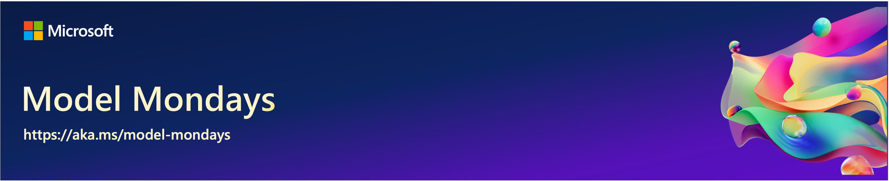

# Model Mondays: Build Your Model IQ

Model Mondays is a practical livestream series for building model expertise one week at a time. Explore model capabilities, selection, customization, and the patterns that help developers build effective AI agents with Microsoft Foundry.

- **Model Mondays:** livestreams featuring model news, technical spotlights, and demos.
- **Foundry Fridays:** [on-demand expert AMAs](docs/foundry-fridays/README.md), numbered independently from seasons.
- **Models for Beginners:** [self-guided curriculum](https://aka.ms/models-for-beginners).

## Foundry Friday AMA Spotlight

### [How do you know what to optimize next in your AI agent? Ask the experts!](docs/foundry-fridays/2026-09-25-ama-048.md)

**September 25, 2026 · 1:30-2:00 PM ET** 
**Speaker:** Charles Kim, Product Lead, Core AI, Microsoft

Join an interactive discussion about production agent evaluation, optimization loops, live demos, and the decisions teams face after an agent goes live.

[Join the AMA](https://aka.ms/model-mondays/chat) · [Read the announcement](https://techcommunity.microsoft.com/blog/azuredevcommunityblog/how-do-you-know-what-to-optimize-next-in-your-ai-agent-ask-the-experts/4559401)

## Season 4: Model Spotlights for Agent Builders

Season 4 runs from August 10 through November 2, 2026. Each episode focuses on a model family or model-selection technique relevant to building AI agents.

| Ep | Date | Spotlight | Host | Guest speaker(s) | Page |
|:---:|:---|:---|:---|:---|:---:|
| 01 | Aug 10, 2026 | Spotlight on MAI Models | Amy Boyd | Sophie Lebrecht Yanan Cai | [View](docs/model-mondays/2026-08-10-s04-e01.md) |
| 02 | Aug 17, 2026 | Cohere for Agentic AI | Bethany Jepchumba | Andy Tran | [View](docs/model-mondays/2026-08-17-s04-e02.md) |
| 03 | Aug 24, 2026 | Spotlight on Model Router | Lee Stott | Sanjeev Jagtap | [View](docs/model-mondays/2026-08-24-s04-e03.md) |
| 04 | Aug 31, 2026 | From Research to Reality | Nitya Narasimhan | Gulsimo Osimi Yash Lara | [View](docs/model-mondays/2026-08-31-s04-e04.md) |
| 05 | Sep 14, 2026 | Claude Models in Microsoft Foundry: Tool Integrations in Practice | Gustavo Cordido | Amanda Wong Haoran Cheng | [View](docs/model-mondays/2026-09-14-s04-e05.md) |
| 06 | Sep 21, 2026 | Spotlight on Azure OpenAI | Nitya Narasimhan | Ananya Bishnoi | [View](docs/model-mondays/2026-09-21-s04-e06.md) |
| 07 | Sep 28, 2026 | Mistral OCR-4 & Building AI Agents in Microsoft Foundry | Amy Boyd | Victor Rojo Peyman Mohajerian | [View](docs/model-mondays/2026-09-28-s04-e07.md) |
| 08 | Oct 5, 2026 | Fine-Tuned Models | Bethany Jepchumba | — | [View](docs/model-mondays/2026-10-05-s04-e08.md) |
| 09 | Oct 12, 2026 | Spotlight on Speech Models | Gustavo Cordido | — | [View](docs/model-mondays/2026-10-12-s04-e09.md) |
| 10 | Oct 19, 2026 | Spotlight on Hugging Face | Amy Boyd | — | [View](docs/model-mondays/2026-10-19-s04-e10.md) |
| 11 | Oct 26, 2026 | Spotlight on Open Models | Bethany Jepchumba | — | [View](docs/model-mondays/2026-10-26-s04-e11.md) |
| 12 | Nov 2, 2026 | Spotlight on NVIDIA Models | Nitya Narasimhan | — | [View](docs/model-mondays/2026-11-02-s04-e12.md) |

## Explore More

- [Browse all Foundry Friday AMAs](docs/foundry-fridays/README.md)
- [Read customer stories](docs/customer-stories/README.md)
- [Explore This Week in Hugging Face](docs/hugging-face/README.md)
- [Watch the Model Mondays playlist](https://aka.ms/model-mondays/playlist)

Previous-season episode pages remain available in [`docs/model-mondays/`](docs/model-mondays/).
