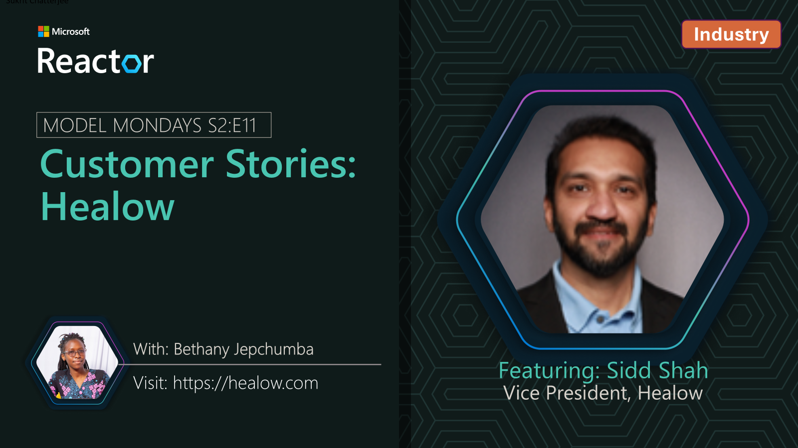
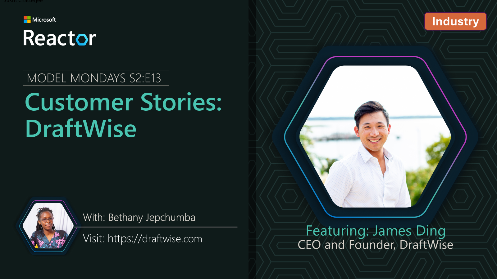
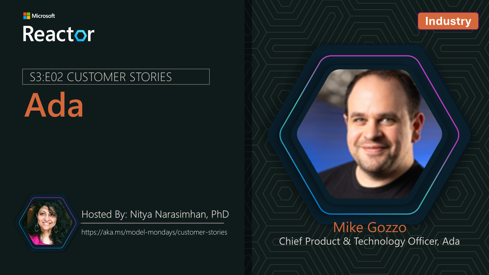

## Customer Stories
As part of Model Mondays, we feature real world customer stories showing how Azure AI Foundry models are solving enterprise problems. 

### Jul 21st 2025: Capacity

We're joined by Steve Frederickson, Head of Product and Zachary Meierhoffer, Product Manager at Capacity, who walk through how Capacity's Answer Engine uses Azure AI Foundry models to unlock insights from knowledge that exists across their organizations.

**Speakers:**

_Steve Frederickson_ is Head of Product for Capacity’s Answer Engine, where he leads the strategy and development of AI-powered knowledge solutions. A serial entrepreneur and product innovator, Steve has pioneered Generative AI capabilities since 2021 to reshape how organizations access and use information.

_Zachary Meierhofer_ is a product manager with a passion for turning complex AI into intuitive solutions. At Capacity, he builds tools that help teams access knowledge instantly and deliver smarter support. With over a decade of experience in AI and search, he blends technical depth with a strong focus on user impact.  

### Jul 28th 2025: SightMachine

In this new segment, we continue talking to customers about real world usage of Azure AI technologies and solutions. In this episode we're joined by Kurt DeMaagd, Chief AI Officer at SightMachine!.

**Speakers:**

_Kurt DeMaagd_ is is Chief AI Officer and Co-founder at Sight Machine. He has developed AI agents and ML applications for manufacturing predictive maintenance, prescriptive energy optimization and waste reduction, decision support tools for quality, and schedule optimization. Kurt has presented on manufacturing AI/ML at conferences such as the Microsoft Ignite, NVIDIA GTC, Qatar Economic Forum, Automate, the American Society for Quality, multiple presentations at the ASQ Statistic Division conference, plus 30+ academic publications. Previously, Kurt was a professor at Michigan State University. He has a Ph.D. in Business Administration from the University of Michigan, Ross School of Business; and a BS in Computer Science from Hope College.

### Aug 04th 2025: Xander

In this new segment, we talk to customers about real world usage of Azure AI technologies and solutions. In this episode we're joined by Marilyn Morgan Westner, Co-founder and Chief Experience Officer, and Alex Westner, Co-founder and CEO at Xander!.

**Speakers:**

_Marilyn Morgan Westner_ is is Chief Experience Officer (CXO) and Co-founder at Xander. As a researcher and educator in language and history, Marilyn earned a Ph.D. in history, focusing on underrepresented groups, culture, and technology. She spent 14 years working with older adults and their families, capturing stories, curating collections, and lecturing at Harvard University and UMass. She spent six years as a research associate at Harvard Business School, writing case studies about entrepreneurship, frontier tech, and corporate trust, and she co-created two new elective courses. Her work has appeared in the Harvard Business Review, Harvard Business Publishing, Founder’s Journey, the Journal of Popular Culture, and several academic book collections.

_Alex Westner_ is is Chief Executive Officer (CEO) and Co-founder at Xander. Alex spent 20+ years leading product strategy at iZotope, Gibson, and Fidelity Labs, Fidelity Investments' innovation incubator. He began his career in engineering, focused on microphone arrays and the “cocktail party problem.” At the MIT Media Lab he trained computers to differentiate individual voices from other sounds. He spent 18 years as a product leader in audio and music technology companies, where he developed and shipped software products that analyzed and separated sound and speech. He led several successful audio products including iZotope RX, which won an Engineering Emmy Award. In 2018, he became a product leader at Fidelity Labs. Working in fintech, he gained experience protecting online privacy and led a team that successfully developed and launched a software platform that helped financial advisors introduce sustainable investing practices to their clients.

### Aug 11th 2025: Atomicwork

In this ongoing segment, we continue talking to customers about real world usage of Azure AI technologies and solutions. In this episode we're joined by Sukrit Chatterjee, AI Research Engineer at Atomicwork.

**Speakers:**

_Sukrit Chatterjee_ is an AI Research Engineer at Atomicwork, designing integrated AI systems that learn from their environment and adapt to task context. With a background in applied AI and system integration, he works at the intersection of research and engineering to advance agentic, context-aware applications.

### Aug 18th 2025: Oracle

_Keeping in with today's theme, we're sharing a prior session with Srinivas Gadde, Senior Director of Sotfware Engineering at Oracle Health, who shares how fine tuning helps improve quality and reduce latency in a clinical AI setting!_.

**Speakers:**

_Sri Gadde_ is a seasoned technology leader with over 15 years of experience in AI-driven software development. As Senior Director of Software Development at Oracle, he leads efforts in conversational AI and AI-powered clinical workflows—advancing healthcare efficiency and patient safety through cutting-edge modeling techniques and responsible AI practices.

### Aug 25th 2025: Healow

_Keeping in with today's theme, we're sharing a prior BUILD 2025 session with Sidd Shah, Vice President at Healow, who shares how Healow uses multimodal AI to enhance healthcare experiences!_.

**Speakers:**

_Sidd Shah_, Vice President at healow, leads consumer engagement tech with 20+ years in health IT, product strategy, business growth and transformative healthcare solutions.

### Sep 08th 2025: Saifr

_In this ongoing segment, we continue talking to customers about real world usage of Azure AI technologies and solutions. In this episode we're joined by David Johnston, CTO and Co-founder at Saifr, and Brett Trainor, Head of Partnerships at Saifr who share how Saifr's AI solutions help financial service developers create compliant apps, services and agents!_.

**Speakers:**

_David Johnston_ (Jono) is the CTO of Saifr, a Fidelity Labs company. 

Jono is a hands-on technologist and full-stack developer with a record of leading highly skilled teams and fueling business growth in consulting and corporate environments.  He has deep technological experience and an entrepreneurial heart with experience founding and leading startups as Chief Technology Officer. His company experiences include Fidelity Investments, Putnam Investments, Sallie Mae, and Safran.

_Brett Trainor_ is the Head of Partners of Saifr, a Fidelity Labs Company.

Over a 16-year career at Fortune 100, Fortune 500, and industry leaders such as Liberty Mutual, State Street and most recently at Fidelity Investments, Brett has held key roles across Risk, Compliance, Strategic Negotiations/Procurement and Enterprise Relationship Management. With a customer first mindset, Brett looks to drive value and solutions at scale through tightly aligned strategic partnerships. Brett holds an MBA from Northeastern University’s D’Amore-McKim School of Business.

### Sep 15th 2025: DraftWise

_In this episode we're sharing a BUILD 2025 segment from James Ding, CEO and Co-founder at DraftWise, sharing how AI models are revolutionizing legal contracting!_.

**Speakers:**

_James Ding_ is the CEO and co-founder of DraftWise, an AI contract drafting, review, and negotiation platform powered by your legal knowledge.

Before founding DraftWise, James led product teams at Palantir, building AI and big data solutions for clients in manufacturing, finance, and cybersecurity. He has invented multiple patents in data security, machine learning, and cloud computing.

### Dec 1st 2025: Adobe

_In this episode we're sharing a Ignite 2025 segment from Nikhil Kumar, Director of Software Development at Adobe, who discusses how new Microsoft Foundry features like Priority Processing are crucial in real-world AI applications to handle load spikes seamlessly!_.

### Dec 8th 2025: Ada

_In this episode we're sharing a Ignite 2025 segment from Mike Gozzo, Chief Product and Technology Officer at Ada, who discusses how a multi-agent architecture and features like Priority Processing are a must-have to drive business outcomes at scale in the customer experience industry_.

**Speakers:**

_Mike Gozzo_ is the Chief Product & Technology Officer at Ada, where he leads AI research, engineering, product management, and design to develop autonomous AI agents for customer service automation. 

A seasoned entrepreneur and angel investor, he co-founded Smooch.io, a company that transformed business-consumer messaging before being acquired by Zendesk in 2019. At Zendesk, he served as SVP of Product Management, overseeing global product and R&D operations. Recognized as one of Quebec's top emerging entrepreneurs, Gozzo continues to mentor and invest in Canadian tech startups while supporting educational and elder-focused charities through his family foundation. He holds a Bachelor's in Electrical Engineering and an MBA in Finance and Strategy from Concordia University's John Molson School of Business. Outside of work, he enjoys cycling, food, and family time, alongside his active role in nurturing early-stage ventures in Canada.

### Dec 15th 2025: eClinicalWorks

_In this episode we're sharing a Ignite 2025 segment from Rakhee Langer, Vice President at eClinicalWorks, who shares a live demo of Voice AI driving stellar patient outcomes in clinical settings, and how sub-second latency is crucial to building trust_.

**Speakers:**

_Rakhee Langer_ is a results-driven leader with over 20 years of experience in healthcare IT. As Vice President at eClinicalWorks, she oversees customer success and business development initiatives, guiding strategic direction and driving the advancement of innovative solutions. Her expertise spans strategy development, product roadmap planning, and execution for Sunoh and ambient listening technologies, ensuring alignment with evolving market needs.

With a Master’s in Biomedical Engineering, Rakhee brings strong analytical and problem-solving capabilities that fuel growth, foster innovation, and deepen customer engagement.

---
