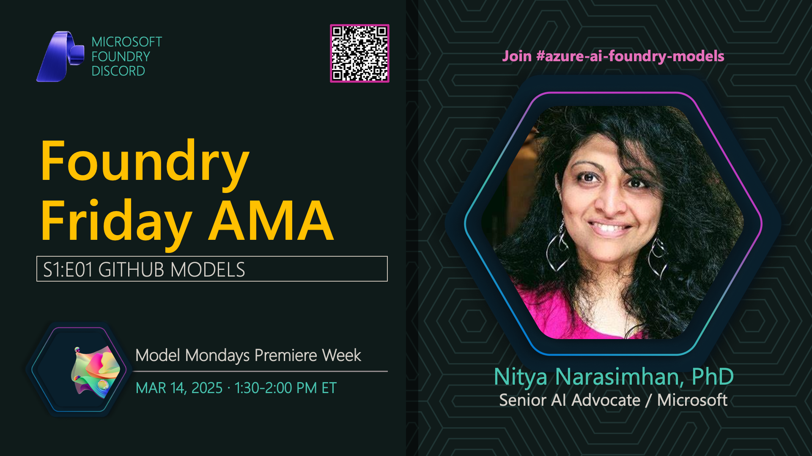

**Title:** GitHub Models AMA

**Speakers:**
- Nitya Narasimhan (Host)

**Description:** Join us for an AMA on GitHub Models, exploring the model marketplace, playground capabilities, and how to get started with AI models on GitHub.

## Topics Discussed
- GitHub Models marketplace
- Model playground features
- Azure Inference API
- Comparing models
- Integration with development workflows
- Free tier and usage limits

## Key Resources
- [The GitHub Marketplace](https://github.com/marketplace/models)
- [The GitHub Codespaces-Models repo](https://github.com/github/codespaces-models)
- [The GitHub Models Documentation](https://docs.github.com/en/github-models)
- [Microsoft Foundry Model Catalog](https://ai.azure.com/explore/models)
- [Azure AI Model Inference API](https://learn.microsoft.com/en-us/azure/machine-learning/reference-model-inference-api?view=azureml-api-2&tabs=python)

**Links:**
- [Registration](https://aka.ms/model-mondays/discord)
