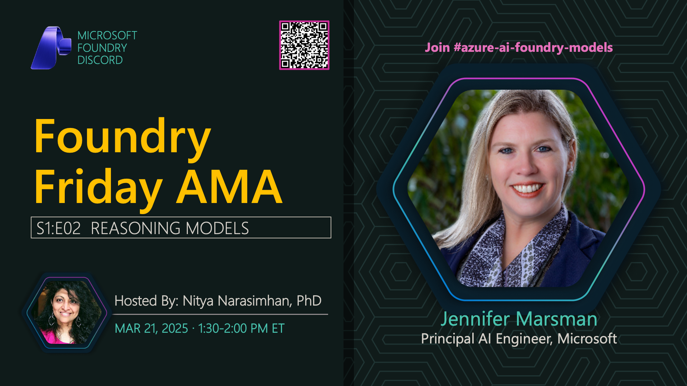

**Title:** Reasoning Models AMA

**Speakers:**
- Nitya Narasimhan (Host)
- Jennifer Marsman

**Description:** Deep dive AMA on reasoning models with Jennifer Marsman, discussing OpenAI's o1 series, DeepSeek, and how reasoning models work.

## Topics Discussed
- Reasoning model architecture
- Chain-of-thought reasoning
- Use cases and applications
- Performance vs cost tradeoffs
- When to use reasoning models
- OpenAI o1 vs DeepSeek comparison

## Key Resources
- [GitHub Models](https://github.com/marketplace/models)
- [Azure AI Foundry Model Catalog](https://ai.azure.com/explore/models)
- [Jennifer Marsman's Sample Repo](https://github.com/jennifermarsman/o1Analysis)

**Links:**
- [Registration](https://aka.ms/model-mondays/discord)
