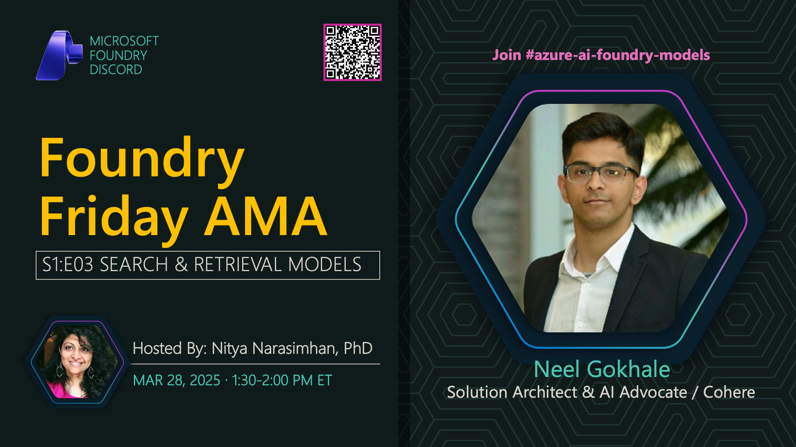

**Title:** Search & Retrieval AMA

**Speakers:**
- Nitya Narasimhan (Host)
- Neel Gokhale (Cohere)

**Description:** AMA session on search and retrieval models with Cohere, focusing on rerank models and semantic search capabilities.

## Topics Discussed
- Cohere Rerank models
- Semantic search techniques
- Vector search vs keyword search
- RAG (Retrieval Augmented Generation)
- Search quality optimization
- Integration patterns

**Links:**
- [Registration](https://aka.ms/model-mondays/discord)
