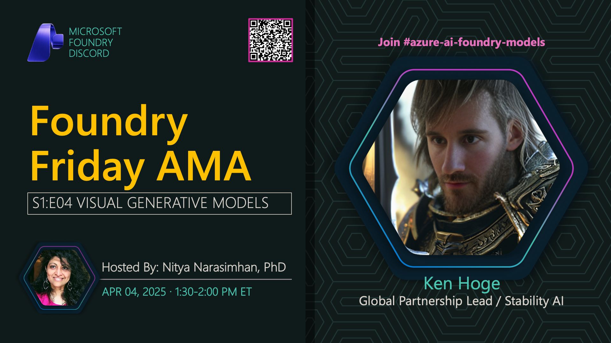

**Title:** Visual Generative Models AMA

**Speakers:**
- Nitya Narasimhan (Host)
- Ken Hoge (Stability AI)

**Description:** AMA on visual generative models with Stability AI, exploring image generation, Stable Diffusion, and creative AI applications.

## Topics Discussed
- Stable Diffusion models
- Prompt engineering for images
- Image-to-image generation
- ControlNet and advanced techniques
- Commercial vs non-commercial models
- Ethical considerations

**Links:**
- [Registration](https://aka.ms/model-mondays/discord)
