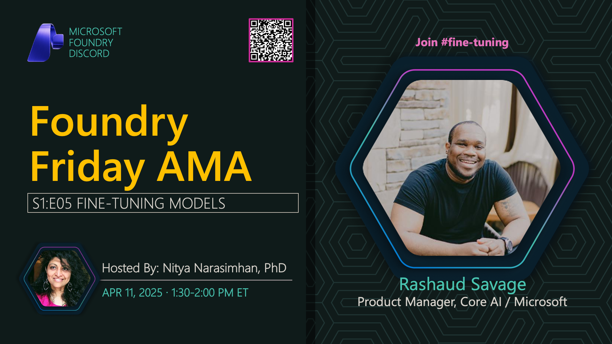

**Title:** Fine-Tuning Models AMA

**Speakers:**
- Nitya Narasimhan (Host)

**Description:** AMA session on fine-tuning models, covering techniques, best practices, and when to use fine-tuning vs prompt engineering.

## Topics Discussed
- Fine-tuning fundamentals
- Dataset preparation
- Training parameters
- Evaluation metrics
- Cost considerations
- Fine-tuning vs prompt engineering
- Mistral models and customization

**Links:**
- [Registration](https://aka.ms/model-mondays/discord)
