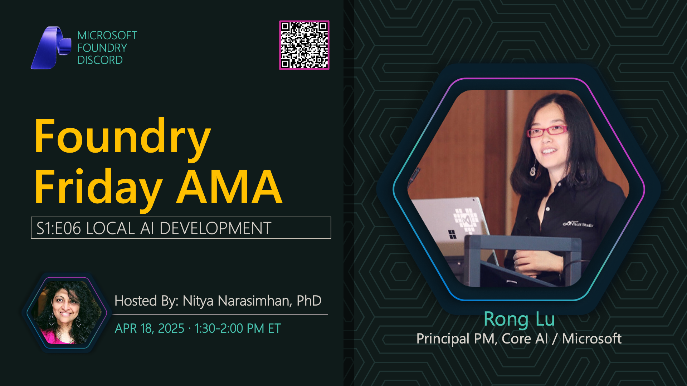

# AMA #006: Local AI Development

**Title:** Local AI Development AMA

**Speakers:**
- Nitya Narasimhan (Host)

**Description:** AMA on local AI development with AI Toolkit, exploring on-device models, local deployment, and development workflows.

## Topics Discussed
- AI Toolkit for VS Code
- Local model deployment
- On-device AI capabilities
- Privacy and security benefits
- Performance optimization
- Hardware requirements
- Offline AI scenarios

**Links:**
- [Registration](https://aka.ms/model-mondays/discord)
