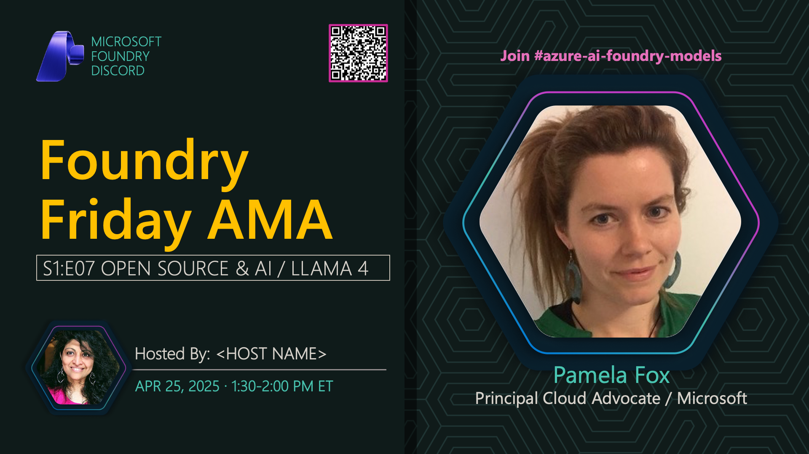

**Title:** Open Source Models AMA

**Speakers:**
- Nitya Narasimhan (Host)

**Description:** AMA session on open source AI models, featuring Meta's Llama 4 and the broader open source model ecosystem.

## Topics Discussed
- Llama 4 model family
- Open source vs proprietary models
- Model licensing considerations
- Community contributions
- Hugging Face integration
- Model selection criteria
- Commercial usage rights

**Links:**
- [Registration](https://aka.ms/model-mondays/discord)
