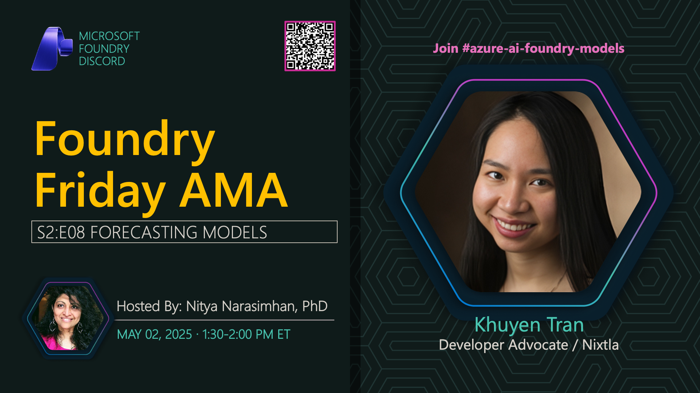

**Title:** Forecasting Models AMA

**Speakers:**
- Nitya Narasimhan (Host)
- Nixtla (TimeGEN)

**Description:** AMA on forecasting models with Nixtla, exploring time series prediction, TimeGEN capabilities, and forecasting use cases.

## Topics Discussed
- Time series forecasting fundamentals
- TimeGEN model architecture
- Forecasting accuracy metrics
- Seasonal patterns and trends
- Multivariate forecasting
- Real-world applications
- Integration with business intelligence

**Links:**
- [Registration](https://aka.ms/model-mondays/discord)
