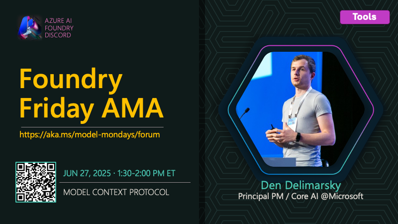

# AMA #010: Model Context Protocol

**Date:** June 27, 2025

**Speakers:**
- Den Delimarsky

## About this AMA

Join us for an AMA on Model Context Protocol (MCP) with Den Delimarsky.

Curious about how to extend your AI models and agents with powerful new capabilities? This session dives into the Model Context Protocol (MCP), an open standard for connecting AI models to external tools and data. Den Delimarsky will walk you through the MCP specification, security best practices, and how MCP is used within Microsoft Azure to build agentic applications. Learn how to consume existing MCP servers, develop your own, and unlock new integration patterns for intelligent apps.

## Resources

- [Build Agents using Model Context Protocol on Azure](https://learn.microsoft.com/en-us/azure/developer/ai/intro-agents-mcp)
- [How to use the Model Context Protocol (MCP) tool](https://learn.microsoft.com/en-us/azure/ai-foundry/agents/how-to/tools/model-context-protocol-samples)
- [Get started with .NET AI and the Model Context Protocol](https://learn.microsoft.com/en-us/dotnet/ai/get-started-mcp)
