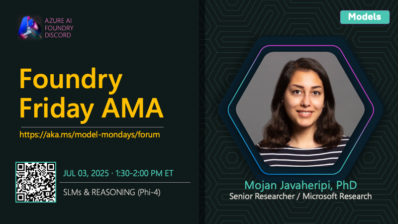

# AMA #011: SLMs and Reasoning

**Date:** July 3, 2025

**Speakers:**
- Mojan Javaheripi

## About this AMA

Join us for an AMA on Small Language Models (SLMs) and Reasoning with Mojan Javaheripi.

How can you bring advanced reasoning to resource-constrained devices? This session explores the latest in Small Language Models (SLMs) like Phi-4, which are redefining what’s possible for agentic apps. Mojan Javaheripi will discuss how SLMs leverage inference-time scaling and chain-of-thought reasoning to deliver powerful results on smaller hardware. Discover use cases, deployment strategies, and how SLMs are making AI more accessible and efficient for everyone.

## Resources

- [Concepts - Small and large language models](https://learn.microsoft.com/en-us/azure/aks/concepts-ai-ml-language-models#when-to-use-small-language-models)
- [Phi-4 and Phi-4 Reasoning Models in Microsoft Foundry](https://learn.microsoft.com/en-us/azure/ai-foundry/concepts/models-featured#microsoft)
- [How to use reasoning models with Microsoft Foundry](https://learn.microsoft.com/en-us/azure/ai-foundry/foundry-models/how-to/use-chat-reasoning)
