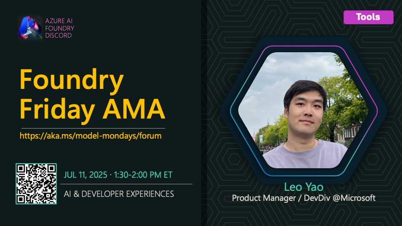

# AMA #012: AI Developer Experiences

**Date:** July 11, 2025

**Speakers:**
- Leo Yao

## About this AMA

Join us for an AMA on AI Developer Experiences with Leo Yao.

Ready to streamline your AI development workflow? This session highlights the latest tools and extensions for building, evaluating, and deploying generative AI apps. Leo Yao will showcase the AI Toolkit and Microsoft Foundry extensions for Visual Studio Code, sharing tips for model selection, agent development, and integrating AI into your projects. Whether you’re new to AI or a seasoned developer, discover how to boost productivity and bring your ideas to life with Microsoft’s developer ecosystem.

## Resources

- [What is the AI Toolkit for Visual Studio Code?](https://learn.microsoft.com/en-us/windows/ai/toolkit/)
- [Work with the Microsoft Foundry for Visual Studio Code extension](https://learn.microsoft.com/en-us/azure/ai-foundry/how-to/develop/get-started-projects-vs-code)
- [Work with Microsoft Foundry Agent Service in Visual Studio Code](https://learn.microsoft.com/en-us/azure/ai-foundry/how-to/develop/vs-code-agents)
