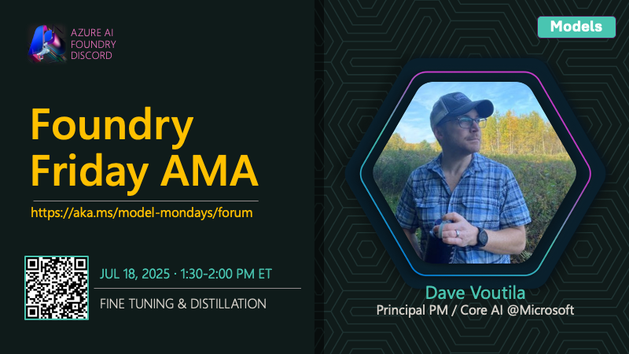

# AMA #013: Fine Tuning & Distillation

**Date:** July 18, 2025

**Speakers:**
- Dave Voutila

## About this AMA

Join us for an AMA on Fine-Tuning and Distillation with Dave Voutila.

## Resources

- [Azure OpenAI in Microsoft Foundry Models fine-tuning considerations](https://learn.microsoft.com/en-us/azure/ai-foundry/openai/concepts/fine-tuning-considerations)
- [Customize a model with fine-tuning](https://learn.microsoft.com/en-us/azure/ai-foundry/openai/how-to/fine-tuning)
- [Azure OpenAI stored completions & distillation](https://learn.microsoft.com/en-us/azure/ai-foundry/openai/how-to/stored-completions#distillation)
