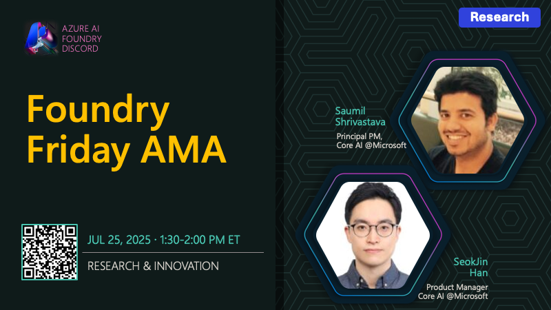

# AMA #014: Research & Innovation

**Date:** July 25, 2025

**Speakers:**
- SeokJin Han
- Saumil Shrivastava

## About this AMA

Join us for an AMA on Research & Innovation in Microsoft Foundry Labs with SeokJin Han and Saumil Shrivastava.

Explore the latest breakthroughs from Microsoft Foundry Labs! This session features SeokJin Han and Saumil Shrivastava discussing the MCP Server for Microsoft Foundry and Magentic-UI for human-in-the-loop AI research. Discover how Microsoft is advancing the state of the art in AI, enabling new experiences and empowering developers to innovate with cutting-edge tools and research projects.

## Resources

- [Compare Microsoft machine learning products and technologies](https://learn.microsoft.com/en-us/azure/architecture/ai-ml/guide/data-science-and-machine-learning#azure-ai-foundry)
- [What is Microsoft Foundry?](https://learn.microsoft.com/en-us/azure/ai-foundry/what-is-azure-ai-foundry)
- [Explore Microsoft Foundry Models](https://learn.microsoft.com/en-us/azure/ai-foundry/concepts/foundry-models-overview)
