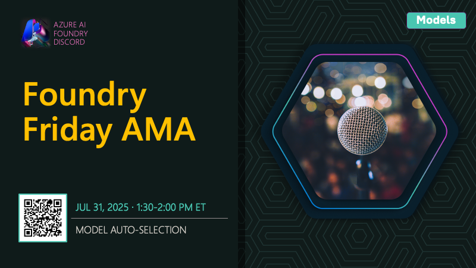

# AMA #015: AI-Assisted Azure Development

**Date:** August 1, 2025

**Speakers:**
- Sandeep Sen

## About this AMA

Join us for an AMA on MCP Server for Azure & GitHub Copilot for Azure

Want to bring the power of AI-assisted development to Azure workflows? Join us as we talk to Sandeep Sen about two key tools – the Azure MCP server, and the GitHub Copilot Extension for Azure – that can help you understand, debug & build with Azure resources and services (beyond just Microsoft Foundry) with the power of natural language

## Resources

- [Azure MCP Server](https://github.com/Azure/azure-mcp)
- [Azure MCP Server Documentation](https://learn.microsoft.com/en-us/azure/developer/azure-mcp-server/)
- [GitHub Copilot for Azure](https://learn.microsoft.com/en-us/azure/developer/github-copilot-azure/)
