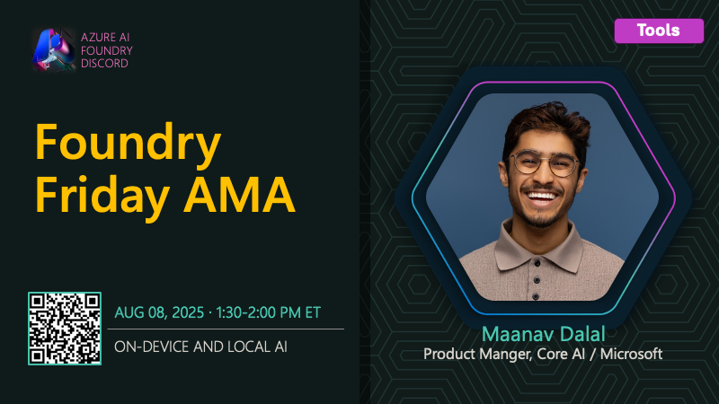

# AMA #016: On-Device & Local AI

**Date:** August 8, 2025

**Speakers:**
- Maanav Dalal

## About this AMA

Join us for an AMA on On-Device & Local AI with Maanav Dalal.

Want to run AI models on your own hardware for privacy, speed, or edge computing? This session spotlights Foundry Local, a solution built on ONNX Runtime for CPUs, NPUs, and GPUs. Maanav Dalal will share how to go from prototype to production with on-device inference, manage models locally, and leverage the flexibility and cost savings of local AI.

## Resources

- [What is Foundry Local?](https://learn.microsoft.com/en-us/azure/ai-foundry/foundry-local/what-is-foundry-local)
- [Foundry Local architecture](https://learn.microsoft.com/en-us/azure/ai-foundry/foundry-local/concepts/foundry-local-architecture)
- [Compile Hugging Face models to run on Foundry Local](https://learn.microsoft.com/en-us/azure/ai-foundry/foundry-local/how-to/how-to-compile-hugging-face-models)
