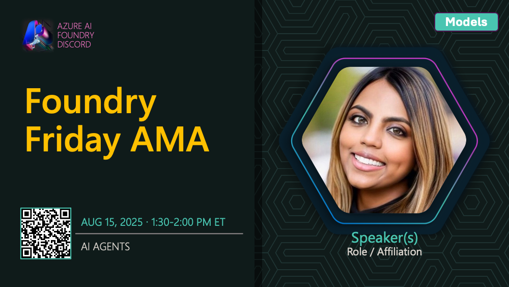

# AMA #017: Models for AI Agents

**Date:** August 15, 2025

**Speakers:**
- Mona Whalin

## About this AMA

Join us for an AMA on Models for AI Agents with Mona Whalin.

Ready to build agentic AI applications? This session introduces the Microsoft Foundry Agent Catalog, featuring open-source samples and best practices for agent development. Mona Whalin will guide you through configuration, design patterns, and how to accelerate your projects by integrating prebuilt agents and tools.

## Resources

- [Get started with the Agent Catalog](https://learn.microsoft.com/en-us/azure/ai-foundry/agents/concepts/agent-catalog)
- [Models supported by Microsoft Foundry Agent Service](https://learn.microsoft.com/en-us/azure/ai-foundry/agents/concepts/model-region-support#azure-ai-foundry-models)
- [What is Microsoft Foundry Agent Service?](https://learn.microsoft.com/en-us/azure/ai-foundry/agents/overview#how-do-agents-in-ai-foundry-work)
