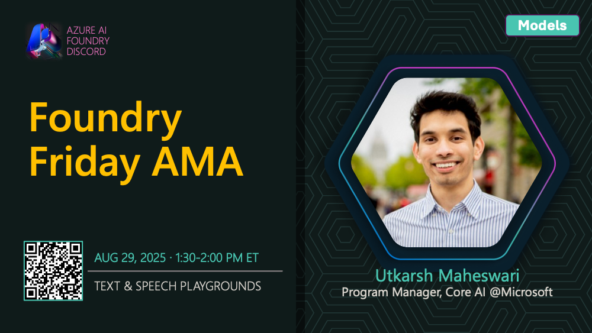

# AMA #019: Text & Speech Playgrounds

**Date:** August 29, 2025

**Speakers:**
- Cenyu Zhang

## About this AMA

Join us for an AMA on Text & Speech Playgrounds with Cenyu Zhang.

## Resources

- [Microsoft Foundry Playgrounds: Audio playground](https://learn.microsoft.com/en-us/azure/ai-foundry/concepts/concept-playgrounds#audio-playground)
- [How to use Azure AI services in Microsoft Foundry portal](https://learn.microsoft.com/en-us/azure/ai-services/connect-services-ai-foundry-portal#try-azure-ai-services-in-the-project-level-playgrounds)
- [Quickstart: Recognize and convert speech to text (ai-studio)](https://learn.microsoft.com/en-us/azure/ai-services/speech-service/get-started-speech-to-text#try-real-time-speech-to-text)
