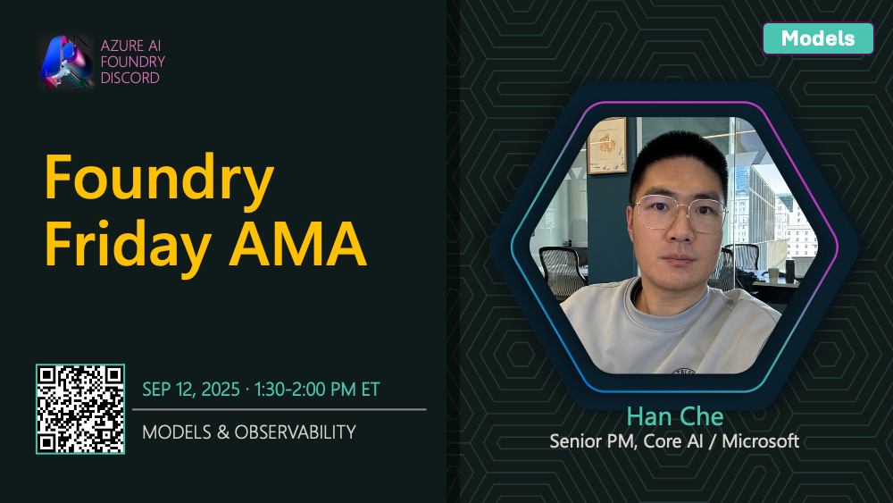

# AMA #020: Models & Observability

**Date:** September 12, 2025

**Speakers:**
- Minsoo Thigpen

## About this AMA

Join us for an AMA on Models & Observability with Minsoo Thigpen.

How do you ensure your AI models are trustworthy and high-performing? This session with Minsoo Thigpen covers observability in Microsoft Foundry, including evaluations, red-teaming, and end-to-end monitoring. Learn how to instrument your AI apps, collect insights, and build reliable, safe generative AI solutions.

## Resources

- [Observability in generative AI](https://learn.microsoft.com/en-us/azure/ai-foundry/concepts/observability#the-three-stages-of-genaiops-evaluation)
- [Viewing AI red teaming results in Microsoft Foundry project (preview)](https://learn.microsoft.com/en-us/azure/ai-foundry/how-to/view-ai-red-teaming-results#view-report-of-each-scan)
- [AI Red Teaming Agent (preview)](https://learn.microsoft.com/en-us/azure/ai-foundry/concepts/ai-red-teaming-agent)
