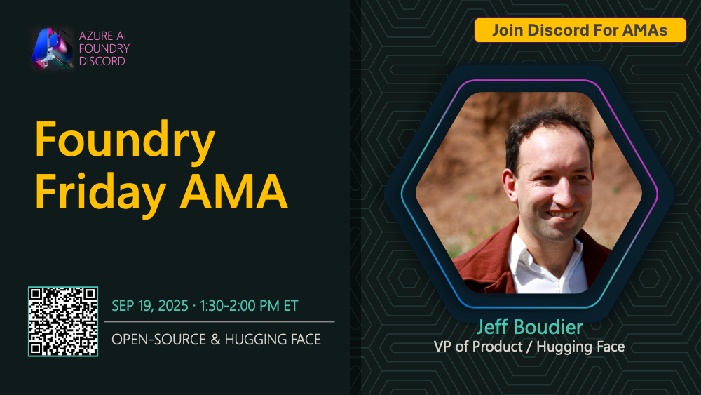

# AMA #021: Open Source Models

**Speakers:**
- Jeff Boudier — VP of Product, Hugging Face

**Date:** September 19, 2025

## About this AMA

Join us for an AMA on Open Source Models in Microsoft Foundry.

Did you know Microsoft Foundry offers access to thousands of open source models, including the Hugging Face collection? In this season finale, we’ll discuss how to get started with open source models, select the right one for your needs, and even request new additions. Learn how to deploy, fine-tune, and integrate these models into your projects for maximum flexibility and innovation.

## Resources

- [Explore Microsoft Foundry Models: Model collections](https://learn.microsoft.com/en-us/azure/ai-foundry/concepts/foundry-models-overview#model-collections)
- [How to use Open Source foundation models curated by Azure Machine Learning](https://learn.microsoft.com/en-us/azure/machine-learning/how-to-use-foundation-models?view=azureml-api-2#import-foundation-models)
- [Compile Hugging Face models to run on Foundry Local](https://learn.microsoft.com/en-us/azure/ai-foundry/foundry-local/how-to/how-to-compile-hugging-face-models)
