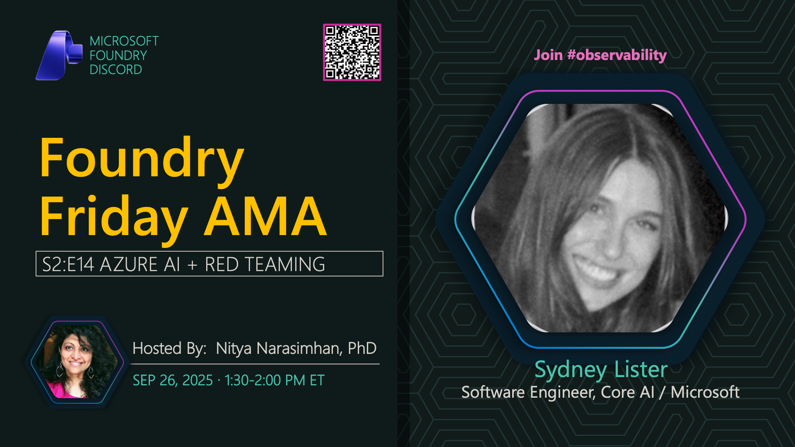

**Title:** Red Teaming AMA

**Speakers:**
- Sydney (Microsoft)
- Nitya Narasimhan (Host)

**Description:** Join us for an AMA on Red Teaming in AI applications, exploring security testing, vulnerability assessment, and best practices for building robust AI systems.

**Topics Covered:**
- Red teaming methodologies for AI systems
- Security testing and vulnerability assessment
- Adversarial attack patterns and defenses
- Best practices for AI safety and security
- Azure AI Content Safety features

**Resources:**
- [Azure AI Content Safety](https://learn.microsoft.com/azure/ai-services/content-safety/)
- [Red Teaming Large Language Models](https://learn.microsoft.com/azure/ai-services/openai/concepts/red-teaming)

**Related:**
- [Model Mondays Replay: AI Agents](../model-mondays/2025-08-11-s02-e09.md)
- [Discord AMA Discussion](https://aka.ms/model-mondays/discord)
