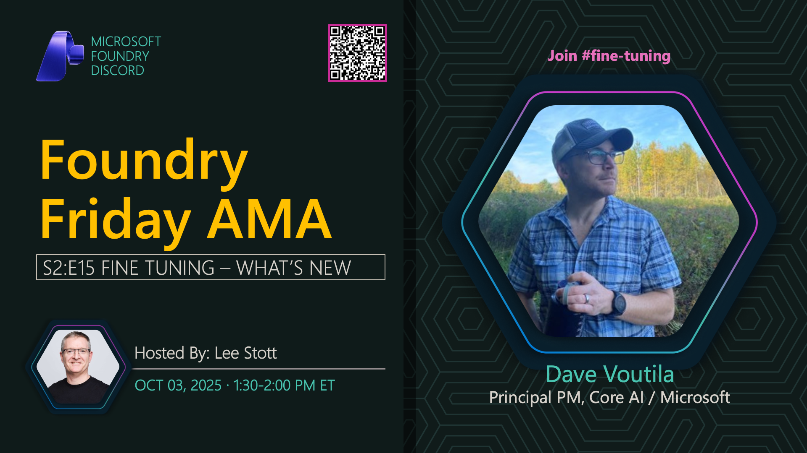

**Title:** Fine Tuning AMA

**Speakers:**
- Dave Voutila (Microsoft)
- Lee Stott (Host)

**Description:** Join us for an AMA on Fine Tuning techniques for language models, exploring customization strategies, training approaches, and practical implementations.

**Topics Covered:**
- Fine-tuning methodologies and best practices
- Training data preparation and curation
- Model adaptation techniques
- Performance optimization
- Microsoft Foundry fine-tuning capabilities

**Resources:**
- [Azure OpenAI Fine-tuning](https://learn.microsoft.com/azure/ai-services/openai/how-to/fine-tuning)
- [Fine-tuning Guide](https://learn.microsoft.com/azure/ai-foundry/concepts/fine-tuning)

**Related:**
- [Model Mondays Replay: Fine Tuning](../model-mondays/2025-07-14-s02-e05.md)
- [Discord AMA Discussion](https://aka.ms/model-mondays/discord)
