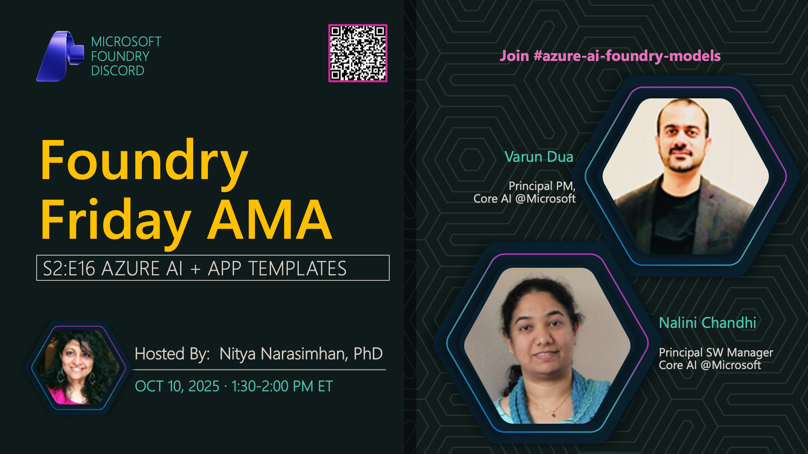

**Title:** AI Templates AMA

**Speakers:**
- Varun Chandramohan (Microsoft)
- Nalini Prabhakaran (Microsoft)
- Nitya Narasimhan (Host)

**Description:** Join us for an AMA on AI Templates and accelerators, exploring ready-to-use solutions, project scaffolding, and rapid prototyping with Azure AI.

**Topics Covered:**
- AI template catalog and offerings
- Project scaffolding and setup
- Best practices for using templates
- Customization and extension patterns
- Azure AI Foundry templates

**Resources:**
- [Azure AI Templates](https://aka.ms/azai/templates)
- [AI Foundry Sample Gallery](https://learn.microsoft.com/azure/ai-foundry/samples/)

**Related:**
- [Model Mondays Replay: Azure Copilot Extension](../model-mondays/2025-07-28-s02-e07.md)
- [Discord AMA Discussion](https://aka.ms/model-mondays/discord)
