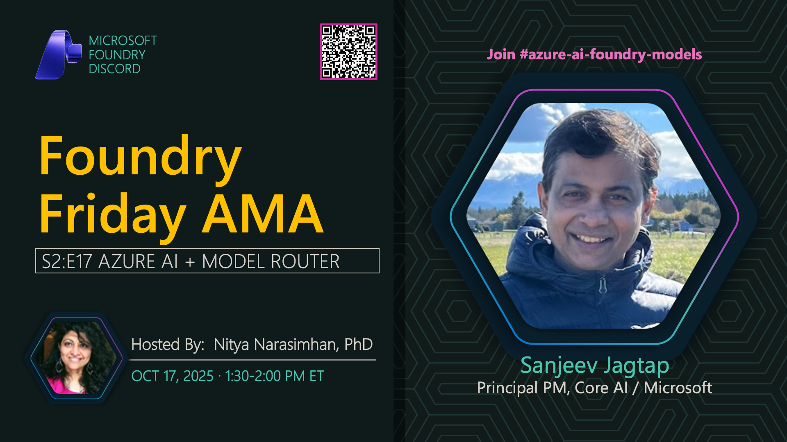

**Title:** Model Router AMA

**Speakers:**
- Sanjeev Jag (Microsoft)
- Nitya Narasimhan (Host)

**Description:** Join us for an AMA on Model Router capabilities in Azure AI Foundry, exploring intelligent routing, load balancing, and optimizing model selection for production workloads.

**Topics Covered:**
- Model Router architecture and design
- Automatic routing strategies
- Load balancing and fallback mechanisms
- Cost optimization with routing
- Performance monitoring and metrics

**Resources:**
- [Azure AI Model Router](https://learn.microsoft.com/azure/ai-foundry/openai/concepts/model-router)
- [Model Router Documentation](https://learn.microsoft.com/azure/ai-foundry/concepts/model-router)

**Related:**
- [Model Mondays Replay: DeepSeek-R1 Reasoning](../model-mondays/2025-06-16-s02-e01.md)
- [Discord AMA Discussion](https://aka.ms/model-mondays/discord)
