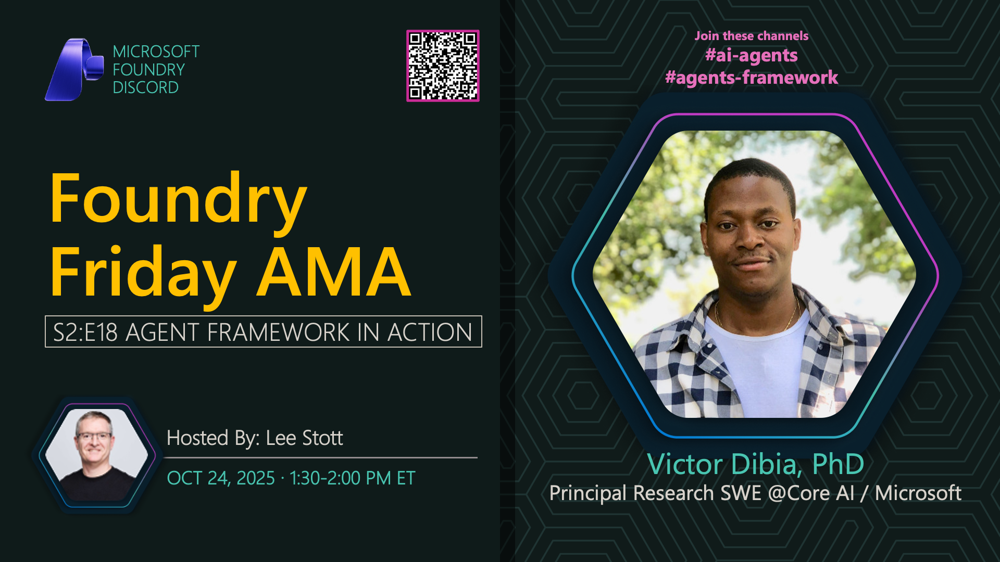

**Title:** Agent Framework AMA

**Speakers:**
- Victor Dibia (Microsoft)
- Lee Stott (Host)

**Description:** Join us for an AMA on the Microsoft Agent Framework, exploring agentic patterns, multi-agent systems, and building intelligent AI agents with Azure AI.

**Topics Covered:**
- Agent Framework architecture and capabilities
- Multi-agent design patterns
- Agent communication and orchestration
- Tool integration and function calling
- Best practices for building production agents

**Resources:**
- [Microsoft Agent Framework](https://microsoft.github.io/autogen/)
- [Azure AI Agent Service](https://learn.microsoft.com/azure/ai-foundry/concepts/ai-agents)

**Related:**
- [Model Mondays Replay: Model Context Protocol](../model-mondays/2025-06-23-s02-e02.md)
- [Discord AMA Discussion](https://aka.ms/model-mondays/discord)
