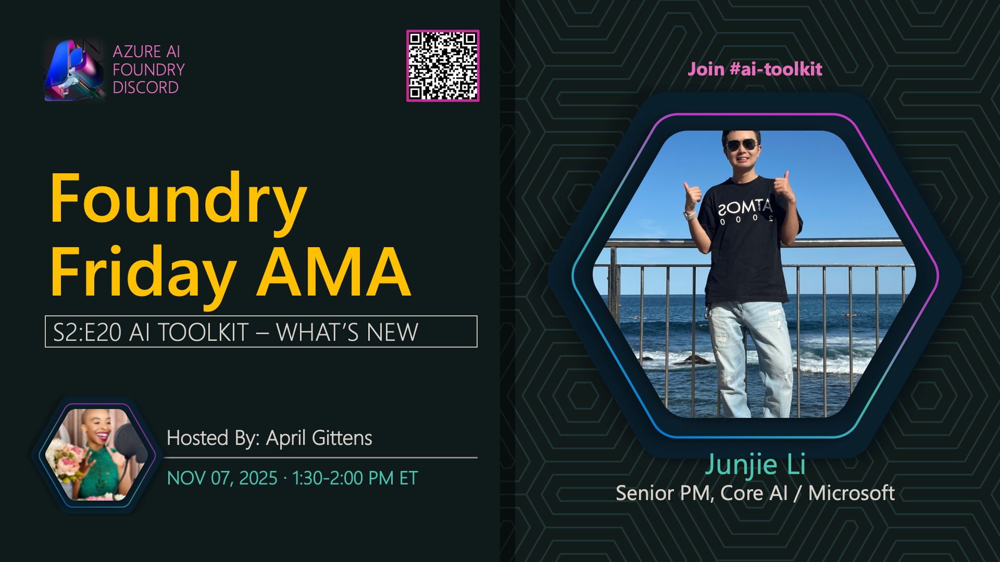

**Title:** New in AI Toolkit AMA

**Speakers:**
- Junjie Li (Microsoft)
- April Speight (Host)

**Description:** Join us for an AMA on the latest updates and features in the AI Toolkit for VS Code, exploring new capabilities, workflows, and developer experience improvements.

**Topics Covered:**
- Latest AI Toolkit features and updates
- Model development workflows
- Local testing and deployment
- Integration with Microsoft Foundry
- Developer productivity enhancements

**Resources:**
- [AI Toolkit for VS Code](https://marketplace.visualstudio.com/items?itemName=ms-windows-ai-studio.windows-ai-studio)
- [AI Toolkit Documentation](https://learn.microsoft.com/windows/ai/toolkit/)

**Related:**
- [Model Mondays Replay: AI Toolkit Extension](../model-mondays/2025-07-07-s02-e04.md)
- [Discord AMA Discussion](https://aka.ms/model-mondays/discord)
