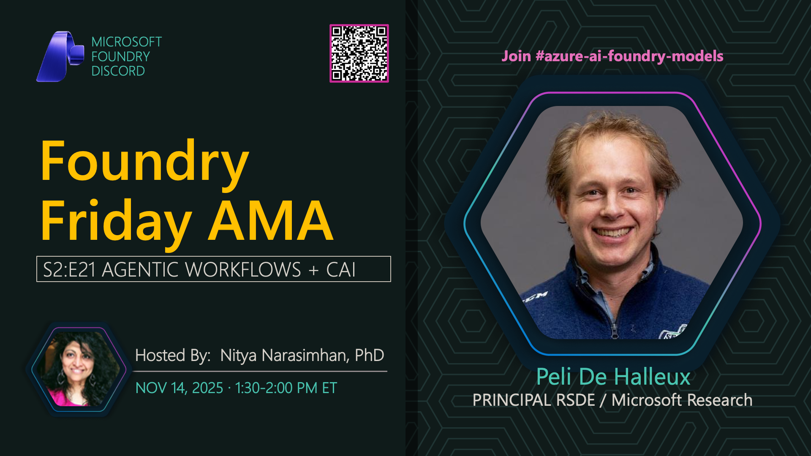

**Title:** Continuous AI & Agentic Workflows AMA

**Speakers:**
- Peli De Halleux (Microsoft)
- Nitya Narasimhan (Host)

**Description:** Join us for an AMA on Continuous AI and Agentic Workflows, exploring automation, CI/CD for AI applications, and building production-ready agentic systems.

**Topics Covered:**
- Continuous AI and MLOps practices
- Agentic workflow patterns
- CI/CD pipelines for AI applications
- Monitoring and observability
- Production deployment strategies

**Resources:**
- [Azure AI MLOps](https://learn.microsoft.com/azure/machine-learning/concept-mlops)
- [GitHub Actions for AI](https://github.com/features/actions)

**Related:**
- [Model Mondays Replay: Agentic Workflows](../model-mondays/2025-08-04-s02-e08.md)
- [Discord AMA Discussion](https://aka.ms/model-mondays/discord)
