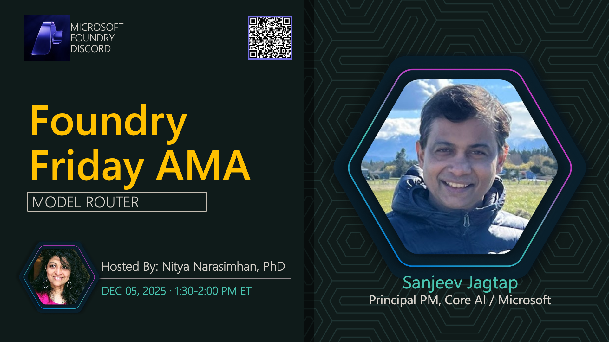

**Title:** Model Router AMA

**Speakers:**
- Nitya Narasimhan (Host)
- Sanjeev Jagtap

**Description:** Ask us anything about the Microsoft Foundry Model Router, including implementation strategies, cost optimization, and real-world use cases.

## Topics Discussed
- Model Router architecture
- Automatic model selection
- Cost optimization strategies
- Performance benchmarking
- Integration with existing applications
- Custom routing rules

## Key Resources
- [AI Tour Lab: Automate Model Selection](https://github.com/microsoft/aitour26-LTG153-automate-model-selection-and-ai-app-design-with-microsoft-foundry)

**Links:**
- [Registration](https://aka.ms/model-mondays/discord)
