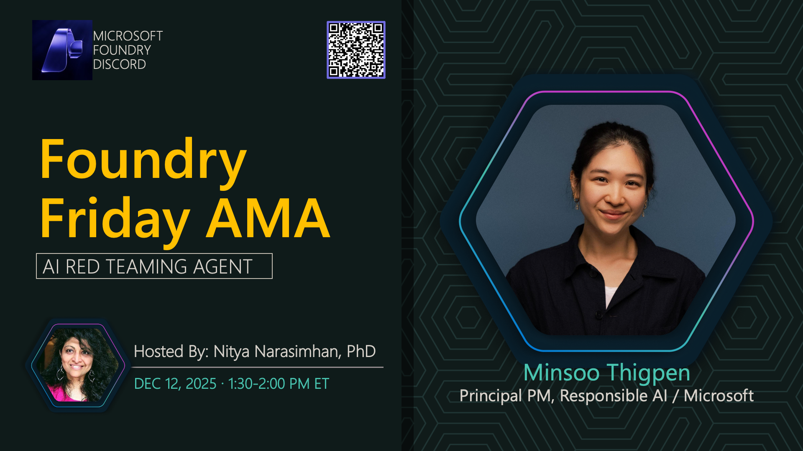

**Title:** Red Teaming AMA

**Speakers:**
- Nitya Narasimhan (Host)

**Description:** Join us to discuss AI red teaming techniques, security best practices, and how to safeguard your AI applications.

## Topics Discussed
- Red teaming fundamentals
- Automated adversarial testing
- Security vulnerabilities in AI
- Responsible AI practices
- Testing frameworks and tools

## Key Resources
- [Ignite Lab: Safeguard Your Agents](https://github.com/microsoft/ignite25-LAB516-safeguard-your-agents-with-ai-red-teaming-agent-in-microsoft-foundry)

**Links:**
- [Registration](https://aka.ms/model-mondays/discord)
