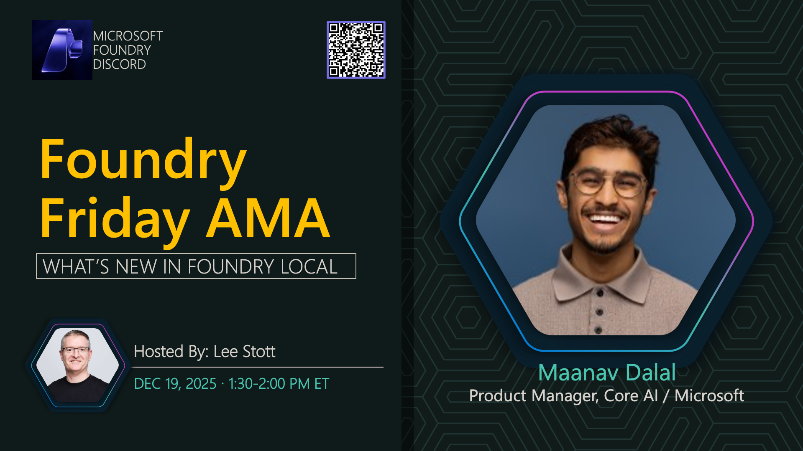

# AMA #033: Edge AI and Foundry Local

**Title:** Edge AI and Foundry Local AMA

**Speakers:**
- Nitya Narasimhan (Host)

**Description:** Discuss edge deployment, local model execution, and the benefits of running AI at the edge.

## Topics Discussed
- Edge AI architecture
- Local model deployment
- Performance optimization
- Privacy and security benefits
- Hardware considerations

## Key Resources
- [Edge AI for Beginners](https://github.com/microsoft/edgeai-for-beginners)

**Links:**
- [Registration](https://aka.ms/model-mondays/discord)
