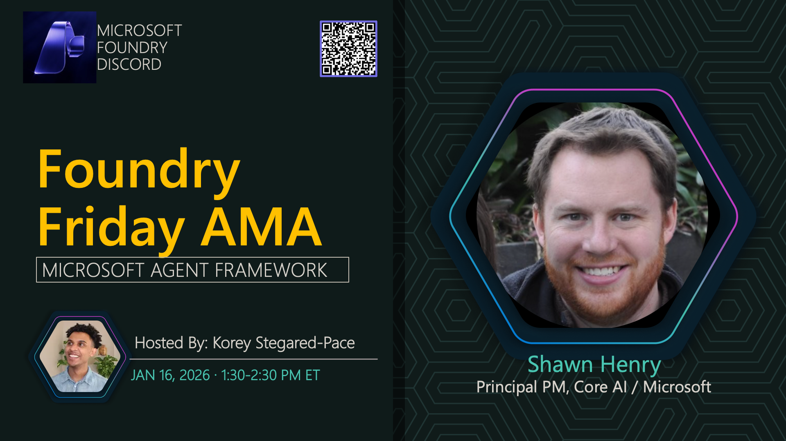

**Title:** Microsoft Agent Framework AMA

**Speakers:**
- Host TBA

**Description:** Ask us anything about the Microsoft Agent Framework, including implementation strategies, agent design patterns, and building agentic systems.

## Topics Discussed
- Microsoft Agent Framework architecture
- Agent design patterns
- Multi-agent orchestration
- Integration with existing applications
- Best practices for agent development

**Links:**
- [Registration](https://aka.ms/model-mondays/discord)
