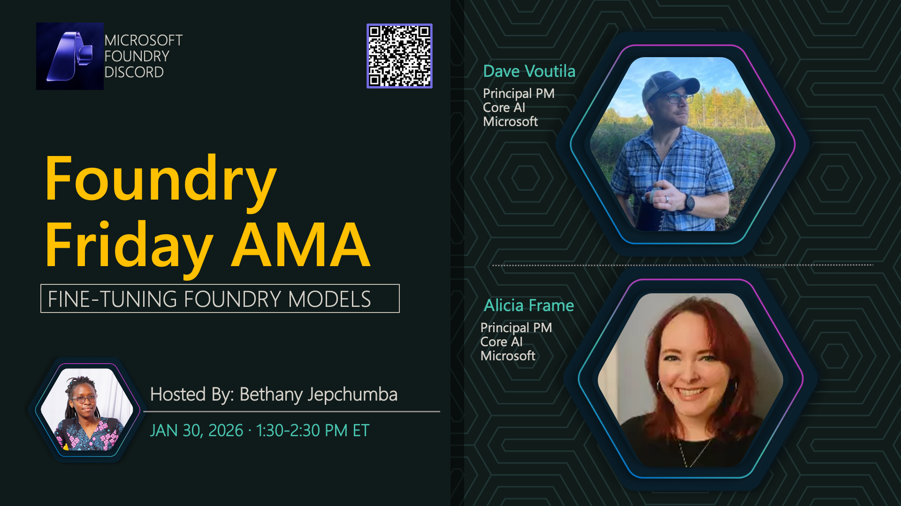

**Title:** Fine Tuning & Responses API AMA

**Speakers:**
- Host TBA

**Description:** Join us to discuss fine-tuning techniques and the Responses API for optimizing model performance.

## Topics Discussed
- Fine-tuning best practices
- Responses API capabilities
- Model customization strategies
- Performance optimization
- Cost considerations

**Links:**
- [Registration](https://aka.ms/model-mondays/discord)
