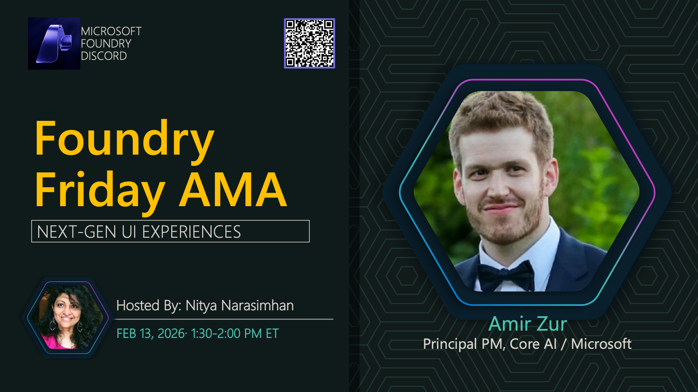

**Title:** Next-Gen UI Experiences AMA

**Speakers:**
- Host TBA

**Description:** Explore next-generation UI experiences powered by AI and how to build modern interfaces.

## Topics Discussed
- AI-powered UI design
- Microsoft Foundry portals
- User experience patterns
- Accessibility considerations
- Building conversational interfaces

**Links:**
- [Registration](https://aka.ms/model-mondays/discord)
