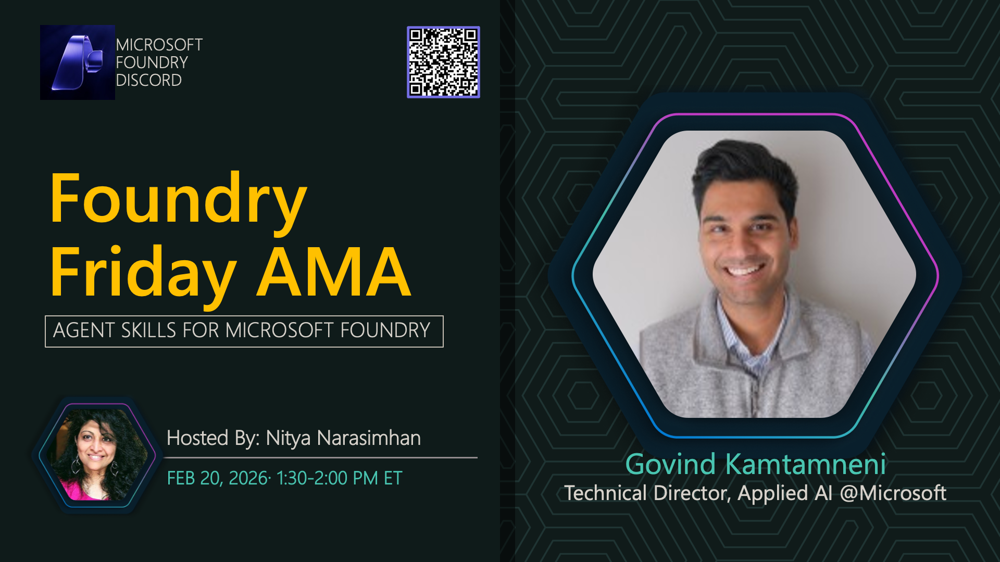

**Title:** Research Models AMA

**Speakers:**
- Host TBA

**Description:** Dive into research models and experimental AI capabilities available in Microsoft Foundry Labs.

## Topics Discussed
- Research models overview
- Experimental features
- Early access programs
- Use cases for research models
- Feedback and iteration

**Links:**
- [Registration](https://aka.ms/model-mondays/discord)
