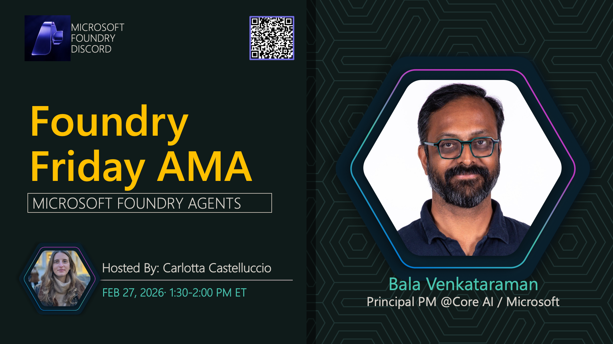

# AMA #040: Microsoft Foundry Agents

**Title:** Microsoft Foundry Agents AMA

**Speakers:**
- Bala Venkataraman — Partner Group Product Manager, Microsoft

**Description:** Discuss Microsoft Foundry Agents, including capabilities, deployment, and integration strategies.

## Topics Discussed
- Foundry Agents overview
- Agent capabilities
- Deployment patterns
- Integration with services
- Monitoring and management

**Links:**
- [Registration](https://aka.ms/model-mondays/discord)
