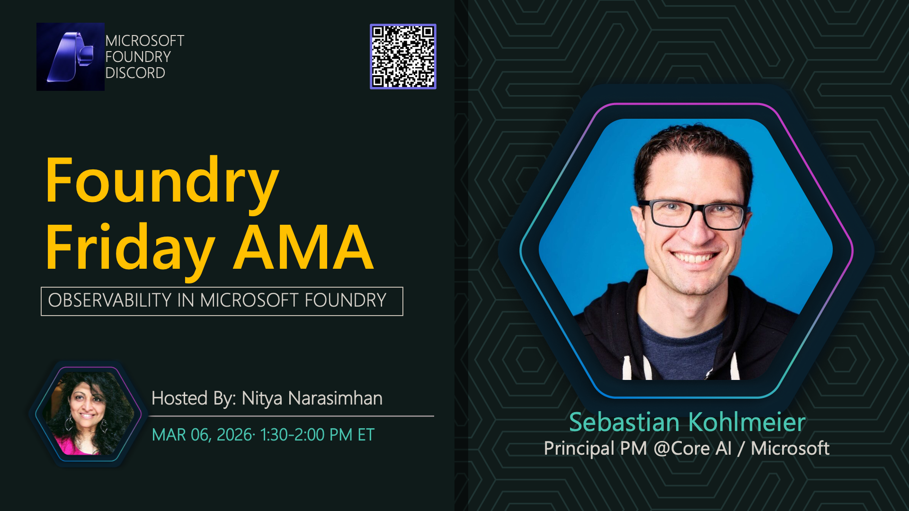

# AMA #041: Observability in Microsoft Foundry

**Title:** Observability in Microsoft Foundry

**Speaker:** Sebastian Kohlmeier

**Description:** Building trustworthy AI agents requires an end-to-end observability capability that lets us trace, monitor, and evaluate, agentic task execution at enterprise scale. Join us as we talk to Sebastian Kohlmeier about Observability capabilities in Microsoft Foundry.

## Topics Discussed
- Microsoft Foundry
- Agentic Evaluations
- Tracing & Telemetry
- Monitoring & Insights
- E2E Observability

**Links:**
- [Join the Microsoft Foundry community](https://aka.ms/model-mondays/discord).
