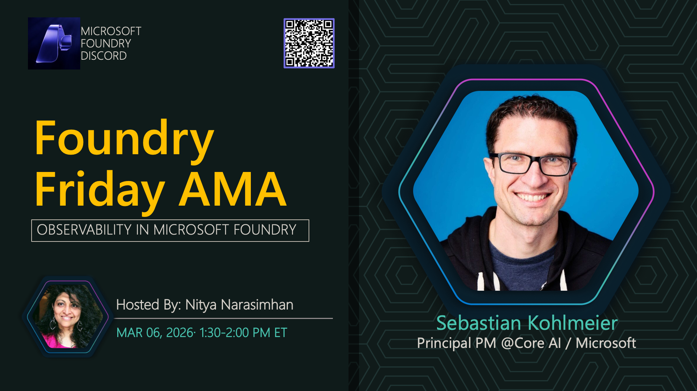

**Title:** Foundry Control Plane AMA

**Speakers:**
- Host TBA

**Description:** Learn about the Foundry Control Plane and how to manage AI resources at scale.

## Topics Discussed
- Control plane architecture
- Resource management
- Governance and compliance
- Multi-region deployment
- Cost optimization

**Links:**
- [Registration](https://aka.ms/model-mondays/discord)
