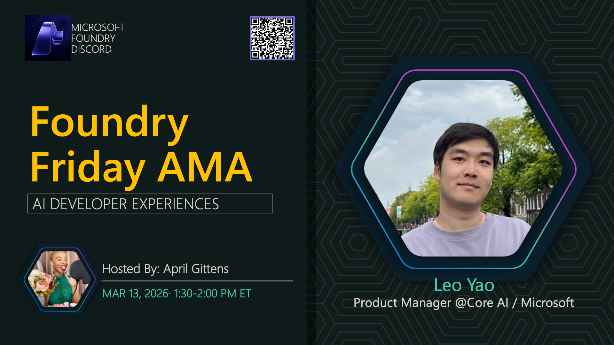

# AMA #042: AI Developer Experience

**Title:** AI Developer Experience AMA

**Speakers:**
- Leo Yao — Product Manager, Microsoft

**Description:** Discuss AI developer tools, SDKs, and experiences for building AI applications.

## Topics Discussed
- Developer tools overview
- AI Toolkit and extensions
- SDK capabilities
- IDE integration
- Developer workflows

**Links:**
- [Registration](https://aka.ms/model-mondays/discord)
