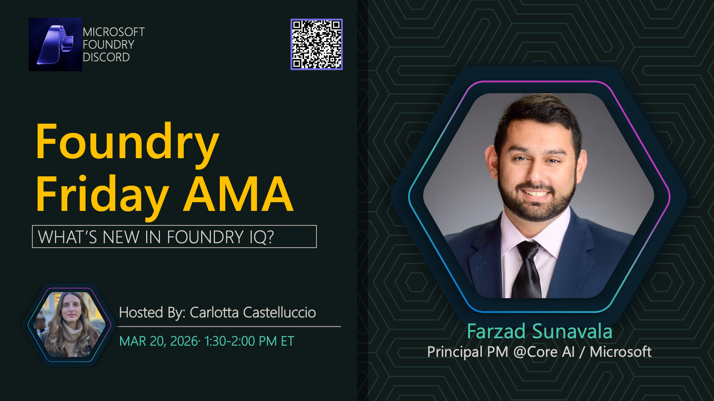

# AMA #043: Foundry IQ

**Title:** Foundry IQ AMA

**Speakers:**
- Farzad Sunavala — Principal Product Manager, Microsoft

**Description:** Explore Foundry IQ capabilities for knowledge retrieval and intelligent information management.

## Topics Discussed
- Foundry IQ overview
- Knowledge retrieval patterns
- Search and indexing
- Integration strategies
- Best practices

**Links:**
- [Registration](https://aka.ms/model-mondays/discord)
