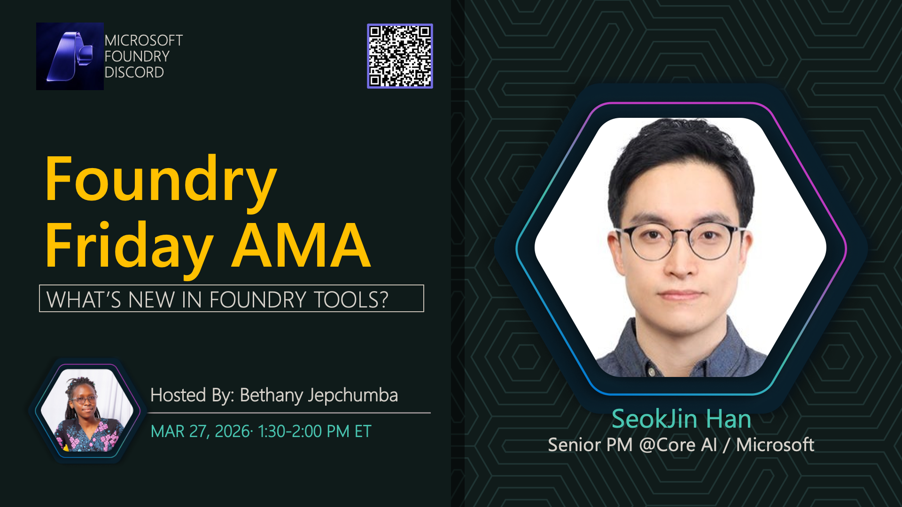

**Title:** Foundry Tools AMA

**Speakers:**
- Host TBA

**Description:** Discuss Azure AI services and tools available within the Foundry ecosystem.

## Topics Discussed
- Foundry tools overview
- Service integrations
- Tool orchestration
- Custom tool development
- Best practices

**Links:**
- [Registration](https://aka.ms/model-mondays/discord)
