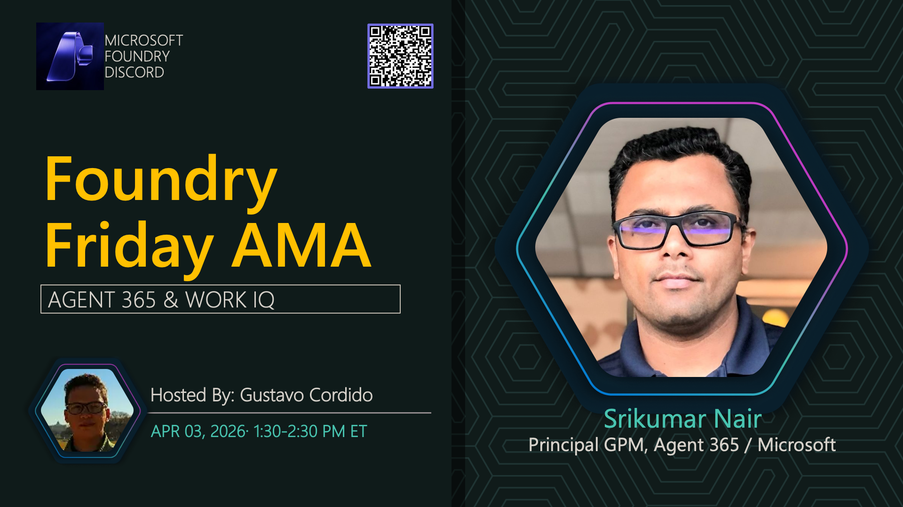

# AMA #045: Agent 365 & Identity

**Title:** Agent 365 & Identity AMA

**Speakers:**
- Srikumar Nair — Partner Product Manager, Microsoft

**Description:** Learn about Microsoft Agent 365 and identity integration for enterprise AI agents.

## Topics Discussed
- Microsoft Agent 365 overview
- Identity and access management
- Enterprise integration
- Security considerations
- Compliance and governance

**Links:**
- [Registration](https://aka.ms/model-mondays/discord)
