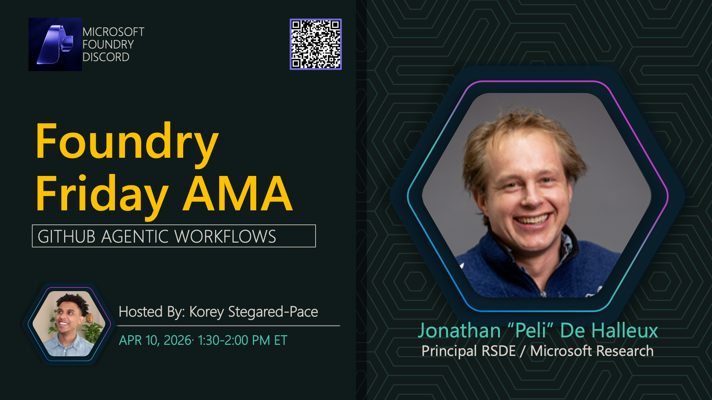

**Title:** GitHub Agentic Workflows AMA

**Speakers:**
- Host TBA

**Description:** Explore GitHub Agentic Workflows and how to build automated development workflows with AI.

## Topics Discussed
- GitHub Agentic Workflows overview
- Workflow automation patterns
- AI-powered development
- Integration with GitHub
- Best practices

**Links:**
- [Registration](https://aka.ms/model-mondays/discord)
