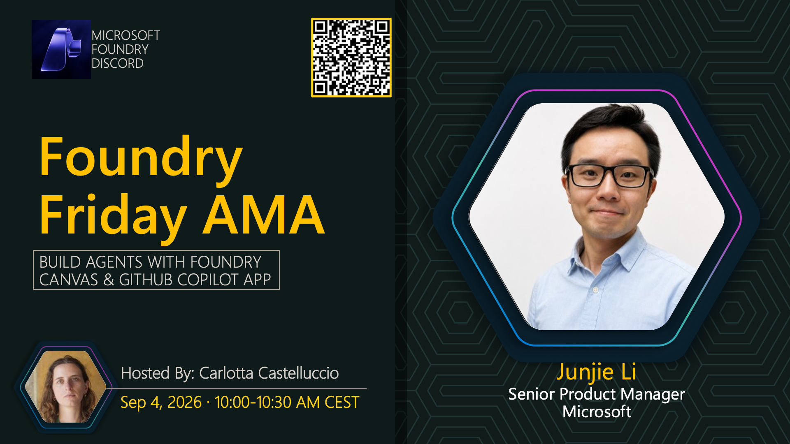

# AMA #047: Build Agents with Foundry Canvas & GitHub Copilot App

**Date:** September 4, 2026  
**Time:** 10:00-10:30 AM CEST

**Speakers:**
- Carlotta Castelluccio (Host)
- Junjie Li — Senior Product Manager, Microsoft

## About this AMA

An on-demand Foundry Friday session about building agents with Foundry Canvas in the GitHub Copilot app.
