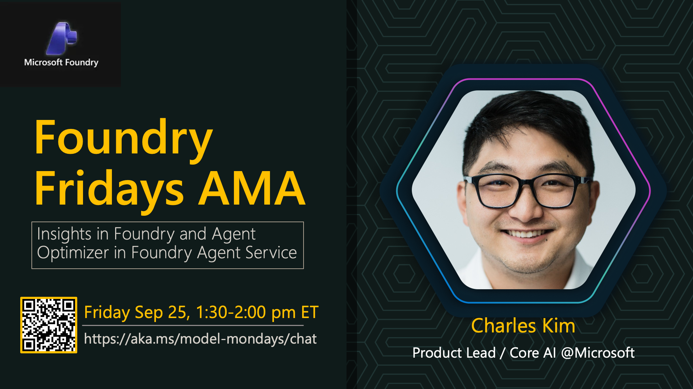

# AMA #049: Insights in Foundry and Agent Optimizer in Foundry Agent Service

**Date:** September 25, 2026  
**Time:** 1:30-2:00 PM ET

**Speakers:**
- Charles Kim — Product Lead, Core AI, Microsoft

## About this AMA

You shipped an agent. It is running in production. Now comes the harder question: What should you optimize first, and how do you move from recurring failures to a reliable, trustworthy, scalable product? Join Microsoft's agent optimization engineering leaders for an interactive ask-me-anything session covering production agent evaluation, optimization loops, live demos, and open Q&A.

## Links

- [Join](https://aka.ms/model-mondays/chat)
- [Announcement](https://techcommunity.microsoft.com/blog/azuredevcommunityblog/how-do-you-know-what-to-optimize-next-in-your-ai-agent-ask-the-experts/4559401)
