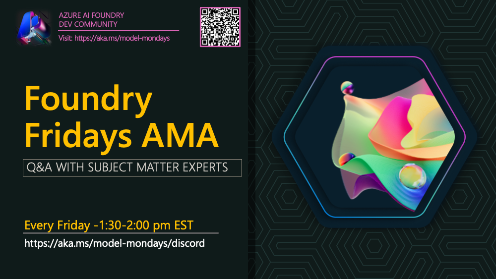

# 🎙️ Foundry Friday AMA - Demos & QA with Experts

There are 11K+ models in the Microsoft Foundry model catalog, 2M+ community variants on Hugging Face, and new model-related tools & announcements happening daily! How do you keep up your knowledge and skills?

By building your Model IQ - one week at a time - with livestreams on Mondays and AMAs on Fridays!

1. **#ModelMonday** · live every Monday @1:30pm ET · RSVP: https://aka.ms/model-mondays/rsvp
2. **#FoundryFriday** · AMA every Friday @1:30pm ET · Join Discord: https://aka.ms/model-mondays/discord

---

## 🗓️ | Season 3: Dec 2025 - Apr 2026

> _Our tentative AMA schedule is below. Check out the [Model Mondays Schedule](https://aka.ms/model-mondays) for up-to-date information on the speakers and description for each AMA. Watch the [Monday livestream](https://aka.ms/model-mondays/rsvp) to see the speakers demo the relevant technology, prior to Friday's AMA_

| Episode | Let's Talk About | AMA Date | Page | Recap |
|:---|:---|:---|:---|:---|
| 16 | GitHub Agentic Workflows | Apr 10, 2026 | [View](2026-04-10-s03-e16.md) | 🔶 |
| 15 | Agent 365 & Identity | Apr 03, 2026 | [View](2026-04-03-s03-e15.md) | 🔶 |
| 14 | Foundry Tools | Mar 27, 2026 | [View](2026-03-27-s03-e14.md) | 🔶 |
| 13 | Foundry IQ | Mar 20, 2026 | [View](2026-03-20-s03-e13.md) | 🔶 |
| 12 | AI Developer Experience | Mar 13, 2026 | [View](2026-03-13-s03-e12.md) | 🔶 |
| 11 | Foundry Control Plane | Mar 06, 2026 | [View](2026-03-06-s03-e11.md) | 🔶 |
| 10 | Microsoft Foundry Agents | Feb 27, 2026 | [View](2026-02-27-s03-e10.md) | 🔶 |
| 09 | Research Models | Feb 20, 2026 | [View](2026-02-20-s03-e09.md) | 🔶 |
| 08 | Next-Gen UI Experiences | Feb 13, 2026 | [View](2026-02-13-s03-e08.md) | 🔶 |
| 07 | Synthetic Data Generation | Feb 06, 2026 | [View](2026-02-06-s03-e07.md) | 🔶 |
| 06 | Fine Tuning & Responses API | Jan 30, 2026 | [View](2026-01-30-s03-e06.md) | 🔶 |
| 05 | US Holiday - No AMA | Jan 23, 2026 | [View](2026-01-23-s03-e05.md) | - |
| 04 | Microsoft Agent Framework | Jan 16, 2026 | [View](2026-01-16-s03-e04.md) | 🔶 |
| 03 | Edge AI & Foundry Local | Dec 19, 2025 | [View](2025-12-19-s03-e03.md) | 🔶 |
| 02 | Red Teaming | Dec 12, 2025 | [View](2025-12-12-s03-e02.md) | 🔶 |
| 01 | Model Router | Dec 05, 2025 | [View](2025-12-05-s03-e01.md) | 🔶 |

---

## 🗓️ | Season 2: Jun 2025 - Nov 2025

> _Our tentative AMA schedule is below. Check out the [Model Mondays Schedule](https://aka.ms/model-mondays) for up-to-date information on the speakers and description for each AMA. Watch the [Monday livestream](https://aka.ms/model-mondays/rsvp) to see the speakers demo the relevant technology, prior to Friday's AMA_

| Episode | Let's Talk About | AMA Date | Page | Recap |
|:---|:---|:---|:---|:---|
| 22 | ONNX, Olive & Windows ML | Nov 21, 2025 | [View](2025-11-21-s02-e22.md) | 🔶 |
| 21 | Continuous AI & Agentic Workflows | Nov 14, 2025 | [View](2025-11-14-s02-e21.md) | 🔶 |
| 20 | New in AI Toolkit | Nov 07, 2025 | [View](2025-11-07-s02-e20.md) | 🔶 |
| 19 | Project Samba | Oct 31, 2025 | [View](2025-10-31-s02-e19.md) | 🔶 |
| 18 | Agent Framework | Oct 24, 2025 | [View](2025-10-24-s02-e18.md) | 🔶 |
| 17 | Model Router | Oct 17, 2025 | [View](2025-10-17-s02-e17.md) | 🔶 |
| 16 | AI Templates | Oct 10, 2025 | [View](2025-10-10-s02-e16.md) | 🔶 |
| 15 | Fine Tuning | Oct 03, 2025 | [View](2025-10-03-s02-e15.md) | 🔶 |
| 14 | Red Teaming | Sep 26, 2025 | [View](2025-09-26-s02-e14.md) | 🔶 |
| 13 | Open-Source & Hugging Face | Sep 19, 2025 | 🔶 | [Read the AMA Recap](https://github.com/orgs/azure-ai-foundry/discussions/110) |
| 12 | Models & Observability | Sep 12, 2025 | 🔶 | 🔶 |
| 11 | Text & Speech Playground | Aug 29, 2025 | 🔶 | 🔶 |
| 10 | Microsoft Foundry Speech Playground | Aug 22, 2025 | 🔶 | 🔶 |
| 09 | Models for AI Agents | Aug 15, 2025 | 🔶 | [Read the AMA Recap](https://github.com/orgs/azure-ai-foundry/discussions/109) |
| 08 | On-Device & Local AI | Aug 08, 2025 | 🔶 | [Read the AMA Recap](https://github.com/orgs/azure-ai-foundry/discussions/108) |
| 07 | AI-Assisted Azure Dev | Aug 01, 2025 | 🔶 | [Read the AMA Recap](https://github.com/orgs/azure-ai-foundry/discussions/106) |
| 06 | Research & Innovation | Jul 25, 2025 | 🔶 | [Read the AMA Recap](https://github.com/orgs/azure-ai-foundry/discussions/105) |
| 05 | Fine Tuning & Distillation | Jul 18, 2025 | 🔶 | [Read the AMA Recap](https://github.com/orgs/azure-ai-foundry/discussions/91) |
| 04 | AI & Developer Experience | Jul 11, 2025 | 🔶 | [Read the AMA Recap](https://github.com/orgs/azure-ai-foundry/discussions/90) |
| 03 | SLMs & Reasoning | Jul 03, 2025 | 🔶 | [Read the AMA Recap](https://github.com/orgs/azure-ai-foundry/discussions/76) |
| 02 | Model Context Protocol | Jun 27, 2025 | 🔶 | [Read the AMA Recap](https://github.com/orgs/azure-ai-foundry/discussions/64) |
| 01 | Advanced Reasoning | Jun 20, 2025 | [View](2025-06-20-s02-e01.md) | [Read the AMA Recap](https://github.com/orgs/azure-ai-foundry/discussions/55) |

_Note: For Season 2 episodes 02-13, full AMA pages are being created. In the meantime, you can view the recap discussions linked above or check the archived content in [../../.2025/forum](../../.2025/forum)._

---

## 🗓️ | Season 1: Mar 2025 - May 2025

> _Our tentative AMA schedule is below. Check out the [Model Mondays Schedule](https://aka.ms/model-mondays) for up-to-date information on the speakers and description for each AMA. Watch the [Monday livestream](https://aka.ms/model-mondays/rsvp) to see the speakers demo the relevant technology, prior to Friday's AMA_

| Episode | Let's Talk About | AMA Date | Page | Recap |
|:---|:---|:---|:---|:---|
| 08 | Forecasting Models | May 02, 2025 | [View](2025-05-02-s01-e08.md) | 🔶 |
| 07 | Open Source Models | Apr 25, 2025 | [View](2025-04-25-s01-e07.md) | 🔶 |
| 06 | Local AI Development | Apr 18, 2025 | [View](2025-04-18-s01-e06.md) | 🔶 |
| 05 | Fine-Tuning Models | Apr 11, 2025 | [View](2025-04-11-s01-e05.md) | 🔶 |
| 04 | Visual Generative Models | Apr 04, 2025 | [View](2025-04-04-s01-e04.md) | 🔶 |
| 03 | Search & Retrieval | Mar 28, 2025 | [View](2025-03-28-s01-e03.md) | 🔶 |
| 02 | Reasoning Models | Mar 21, 2025 | [View](2025-03-21-s01-e02.md) | 🔶 |
| 01 | GitHub Models | Mar 14, 2025 | [View](2025-03-14-s01-e01.md) | 🔶 |

---

## 🚀 How to Join

1. **Join the Discord**: [Microsoft Foundry Discord](https://aka.ms/model-mondays/discord)
2. **Follow the #model-mondays channel** for announcements
3. **Attend on Fridays at 1:30pm EST** for live Q&A with experts
4. **Review recap discussions** on the Discord forum after each session

---

## 📋 Format

Each Foundry Friday AMA session includes:
- **Q&A with Subject Matter Experts** - Get your questions answered directly
- **Deep Dives** - Extended discussions on Monday's topics
- **Resource Sharing** - Links, documentation, and sample code
- **Community Showcase** - Share what you're building
- **Networking** - Connect with other AI developers

Join us every Friday!
