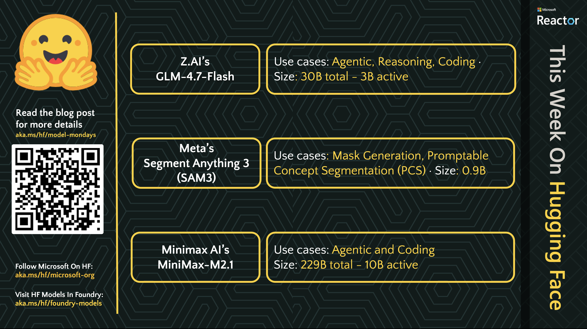

---

# This Week On Hugging Face

Did you know that Microsoft Foundry has 10K+ open-source models through the [Hugging Face Collection](https://aka.ms/hf/foundry-models)? Open source models are going to be a critical part of the AI engineer's toolkit, enabling us to benefit from foundation models and fine-tuned variants that target specialized tasks or domains - as well as optimizations for agentic or generative AI usage.

But how can we keep track of what's new and trending in the open-source model ecosystem? Starting Feb 2026, we are debuting a new feature on the [Model Mondays livestream](https://aka.ms/model-mondays/playlist) as part of our opening **News Highlights** segment in collaboration with our friends at Hugging Face.

## Feb 02, 2026

