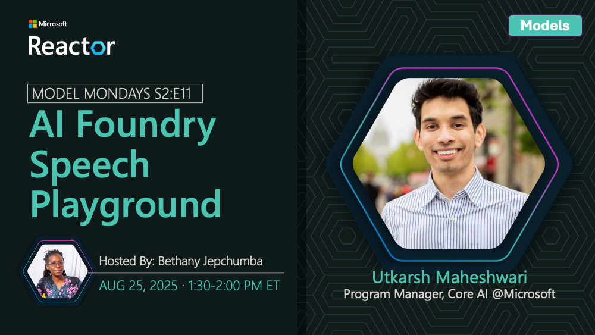

## News Highlights

(To be added)

## Tech Spotlight

**Title:** AI Foundry Speech Playground

**Speaker:** TBA

**Description:** Exploring speech AI capabilities in Microsoft Foundry for voice applications.

## Customer Story

**Title:** Healow Multimodal Healthcare

**Company:** Healow

**Speaker:** Sidd Shah

**Description:** How Healow uses multimodal AI to enhance healthcare experiences.

## Summary

Deep dive into speech AI in Microsoft Foundry, plus a customer story from Healow on multimodal healthcare AI.

**Links:**
- [Recording](https://www.youtube.com/watch?v=Rr4iSCyE7IY&list=PLmsFUfdnGr3wzz6a4E-Szksg92JPng-AL&index=4&pp=iAQB)
- [Recap](https://discord.gg/azureaifoundry?event=1382864441191960696)
- [Slides](https://speakerdeck.com/nitya/model-mondays-s2e11-ai-foundry-speech-playground)
- [Blog](https://techcommunity.microsoft.com/blog/educatordeveloperblog/model-mondays-s2e11-exploring-speech-ai-in-azure-ai-foundry/4448135)
