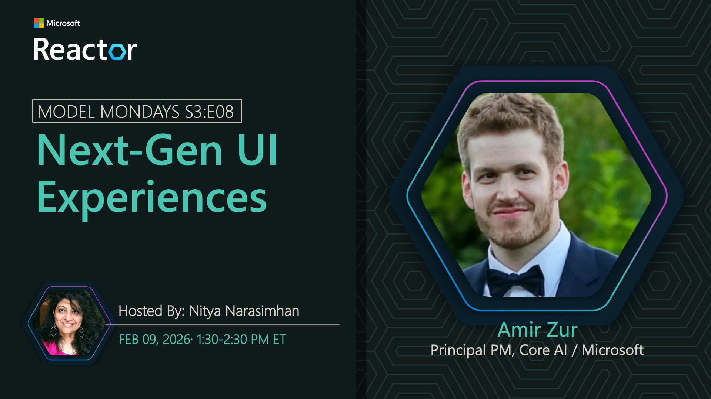

## Foundry Portal & Next-Gen UI

**Date:** February 9, 2026  
**Season:** 3 | **Episode:** 8  
**Host:** [Nitya Narasimhan](https://linkedin.com/in/nityan)

### News Highlights

1. [Microsoft Foundry Portal](https://aka.ms/model-mondays) - Next-generation user interface
2. [End-to-End Workflows](https://aka.ms/model-mondays) - From planning to production
3. [Developer Experience](https://aka.ms/model-mondays) - Streamlined development tools
4. [Agentic AI Platform](https://aka.ms/model-mondays) - Comprehensive agent development
5. [UI/UX Updates](https://aka.ms/model-mondays) - Enhanced interface and features

### Tech Spotlight: Foundry Portal & Next-Gen UI

Building agentic AI solutions requires end-to-end workflows that take you from planning to prototype and production. Discover the Microsoft Foundry portal and the next-gen UI experience that makes this journey seamless.

**Key Features:**
- Unified development environment
- End-to-end workflow orchestration
- Modern, intuitive user interface
- Integrated tools and services
- Streamlined deployment pipeline

**Speaker:** [Amir Zur](https://linkedin.com/in/amirzur)

_Amir Zur is a Product Lead at Microsoft Azure AI, focusing on developer experiences and portal design. He works on creating intuitive, end-to-end workflows that enable developers to build, test, and deploy AI solutions efficiently._

**Resources:**
- [Foundry Portal Documentation](https://aka.ms/model-mondays)
- [UI Guide](https://aka.ms/model-mondays)
- [Video Tutorials](https://aka.ms/model-mondays)

### Summary

Join Amir Zur as he showcases the Microsoft Foundry portal and next-gen UI experience. Learn how the platform provides comprehensive end-to-end workflows for agentic AI development, from initial planning through prototype to production deployment.

**Related AMA:** [View AMA Discussion](../foundry-fridays/2026-02-13-s03-e08.md)
